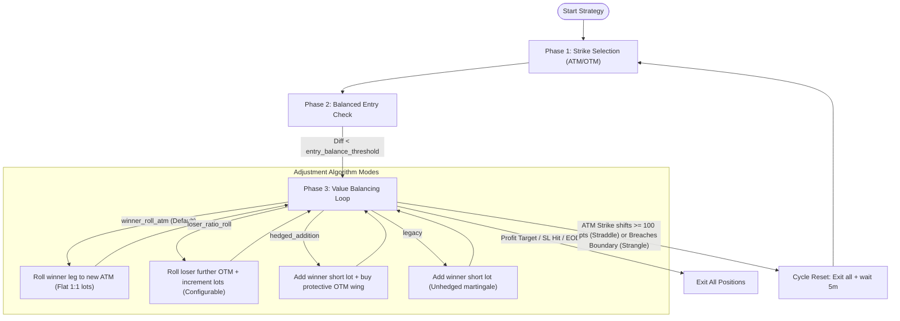

# Dhan Algo Trading — Strategies Documentation

This folder contains the core algorithmic trading strategies implemented under the DhanHQ API framework. The codebase leverages custom mathematical models, technical indicators, and dynamic risk management to execute options trading in both straddles, strangles, and vertical spreads.

---

## 📁 Directory Structure & Strategy Paths
For general project setup, SDK usage, and credentials setup, refer to the [Root README](file:///c:/dhan_algo/dhan_algo/README.md).

```
strategies/
├── value_imbalance/
│   ├── nifty_advanced_imbalance.py      # Core value-imbalance strategy with 4 selectable modes
│   ├── nifty_value_imbalance_straddle.py # LegacyStraddle with lot additions
│   └── nifty_value_imbalance_strangle.py # LegacyStrangle with target strike adjustments
│
├── spread_trend/
│   └── nifty_spread_trend.py            # Trend-following vertical spreads (Supertrend + EMA20)
│
├── expiry/
│   ├── nifty_expiry.py                  # 0DTE Expiry-day option selling with post-SL rebalancing
│   └── strategy.md                      # Detailed walkthrough of the Expiry strategy
│
└── Archives/
    └── nifty_short_straddle.py          # Archived basic straddle strategy
```

---

## ⚙️ Global Risk Management & Rules
Every strategy in this repository adheres to strict risk controls:
*   **Intraday Auto-Exit**: Hardcoded or configurable square-offs between **15:15 and 15:17 IST** to avoid broker auto-square-off charges.
*   **Global Profit Target & Stop Loss**: Monitored on a sub-second basis. Once breached, the strategy exits all legs and pauses operations for the day.
*   **Martingale Caps**: Position additions are strictly capped (default: `max_lots = 4` per leg).
*   **WebSocket Priority**: The helper's live WebSocket data feed is used to fetch LTPs instantly, bypassing REST API rate limits (120–250 calls/min).

---

## 1. Nifty Advanced Value-Imbalance Strategy (`nifty_advanced_imbalance.py`)

This strategy executes straddles or strangles and uses four selectable adjustment modes designed to manage tail risk and optimize premium yield during market trends.



### A. Core Mathematical Concepts

*   **Entry Imbalance Offset**:
    $$\text{entry\_diff\_pct} = \frac{|\text{CE\_val} - \text{PE\_val}|}{\max(\text{CE\_val}, \text{PE\_val})} \times 100$$
*   **Active Imbalance Trigger Threshold**:
    $$\text{Active Threshold} = \text{Threshold (Lot/Strike)} + \text{entry\_diff\_pct}$$

### B. Selectable Adjustment Modes

1.  **`winner_roll_atm`** (Default):
    *   **Goal**: Rolls the untested winning leg closer to the spot ATM strike.
    *   **Action**: Keeps a flat 1:1 lot ratio to eliminate margin inflation.
2.  **`loser_ratio_roll`**:
    *   **Goal**: Rolls the challenged losing leg further OTM and increments quantity (ratio spread) to maintain premium collections safely.
    *   **Action**: Uses a configurable increment count (default: `1` lot increment via `--loser-ratio-lots`).
3.  **`hedged_addition`**:
    *   **Goal**: Adds short lots to the winner leg (martingale) but buys further OTM wings (200 pts out) to hedge against market whipsaws.
4.  **`legacy`**:
    *   **Goal**: Original legacy lot addition strategy on the winner leg (unhedged).

### C. CLI Parameters

| CLI Flag | Default | Description |
| :--- | :--- | :--- |
| **`--live`** | *Flag (Boolean)* | Enables live trading. If omitted, runs in simulated dry-run mode. |
| **`--lots N`** | `1` | Initial lots traded per leg. |
| **`--mode MODE`** | `winner_roll_atm` | Selects adjustment mode (`winner_roll_atm`, `loser_ratio_roll`, `hedged_addition`, `legacy`). |
| **`--loser-ratio-lots N`** | `1` | Number of lots to increment during a loser ratio roll adjustment. |
| **`--entry-type TYPE`** | `straddle` | Entry position type (`straddle` or `strangle`). |
| **`--delta`** | *Flag* | Use delta-based strike selection for strangle mode. |
| **`--target-delta D`** | `0.20` | Target absolute delta in delta strangle mode. |
| **`--premium`** | *Flag* | Use premium-based strike selection for strangle mode. |
| **`--target-premium P`** | `50.0` | Target premium value for premium strangle mode. |
| **`--ce-offset PTS`** | `200` | Points above spot for CE strike in distance strangle. |
| **`--pe-offset PTS`** | `200` | Points below spot for PE strike in distance strangle. |
| **`--target-profit AMT`** | `4000.0` | Global daily profit target in INR. |
| **`--stop-loss AMT`** | `4000.0` | Global daily stop loss in INR. |
| **`--start-time TIME`** | `09:20` | Monitoring start time (HH:MM IST). |

### D. Step-by-Step Walkthrough Example (`winner_roll_atm`)
1.  **Balanced Entry**: Spot = 24,000. Sells 1x 24000 CE @ ₹150, Sells 1x 24000 PE @ ₹145. Initial imbalance offset = 3.3%. Trigger threshold = 25% + 3.3% = 28.3%.
2.  **Market Shift**: Spot rises to 24,080. CE rises to ₹210, PE decays to ₹80. Imbalance = 61.9% (Breaches 28.3%).
3.  **Adjustment**: Buys back 24000 PE @ ₹80 (Realized Profit: +₹65). Sells 1x new ATM 24100 PE @ ₹140.
4.  **New Position**: 1x 24000 CE (avg ₹150) & 1x 24100 PE (avg ₹140).

---

## 2. Nifty Expiry (0DTE) Strategy (`nifty_expiry.py`)

This strategy is optimized for expiry day trading. It monitors decay on both legs and applies individual stop losses with optional post-SL rebalancing.

> [!NOTE]
> For a deep-dive explanation of the execution mechanics, numerical calculations, and rebalancing flow, refer to the [Expiry Strategy Guide](file:///c:/dhan_algo/dhan_algo/strategies/expiry/strategy.md).

### Quick Commands
*   **Dry run with post-SL rebalancing**:
    ```powershell
    python strategies/expiry/nifty_expiry.py --adjustment winner_addition --post-sl-balance
    ```
*   **Live strangle entry using premium targets**:
    ```powershell
    python strategies/expiry/nifty_expiry.py --live --lots 1 --entry-type strangle --premium --target-premium 50.0 --adjustment winner_addition --post-sl-balance
    ```

---

## 3. Nifty Value-Imbalance Straddle (`nifty_value_imbalance_straddle.py`)

A classic Straddle writing strategy. It enters neutral ATM positions and manages trend expansions by adding lots to the winning side or shifting strikes.

### CLI Parameters

| CLI Flag | Default | Description |
| :--- | :--- | :--- |
| **`--live`** | *Flag* | Run in live order placement mode. |
| **`--lots N`** | `1` | Initial lots per leg. |
| **`--entry-balance-threshold`** | `15.0` | Initial balance threshold percentage for entry (e.g. 15%). |
| **`--target-profit AMT`** | `4000.0` | Global daily profit target in INR. |
| **`--stop-loss AMT`** | `4000.0` | Global daily stop loss in INR. |
| **`--start-time TIME`** | `09:20` | Monitoring start time (HH:MM IST). |

### Quick Commands
```powershell
# Dry run with custom entry balance threshold (5%)
python strategies/value_imbalance/nifty_value_imbalance_straddle.py --entry-balance-threshold 5

# Live execution, 2 lots
python strategies/value_imbalance/nifty_value_imbalance_straddle.py --live --lots 2
```

---

## 4. Nifty Value-Imbalance Strangle (`nifty_value_imbalance_strangle.py`)

Similar to the Straddle strategy but enters OTM strangle positions. Supports distance, delta, and premium-based entry options.

### Quick Commands
```powershell
# 200-pt symmetric offset dry run
python strategies/value_imbalance/nifty_value_imbalance_strangle.py --ce-offset 200 --pe-offset 200

# Live execution using delta-based selection (Target 0.15 Delta)
python strategies/value_imbalance/nifty_value_imbalance_strangle.py --live --delta --target-delta 0.15
```

---

## 5. Nifty Spread Trend-Following Strategy (`nifty_spread_trend.py`)

A trend-following options selling strategy that sells Bear Call Spreads or Bull Put Spreads depending on the alignment of the price relative to the **EMA 20** and the **Supertrend (7, 3)** indicators.

### A. Trend Definition

```
        Close > EMA 20  AND  Supertrend = Bullish (1)
                        │
                        ▼ Yes
              [BULLISH TREND SIGNAL]
            Sell Put Vertical Spread
                        │
                        ▼ No
        Close < EMA 20  AND  Supertrend = Bearish (-1)
                        │
                        ▼ Yes
             [BEARISH TREND SIGNAL]
            Sell Call Vertical Spread
```

### B. Execution Security & Margin efficiency
*   **On Entry**: Buys the Long hedge leg first, confirms execution fill, then sells the Short option. This locks in the margin benefit immediately and prevents high naked margin requirements.
*   **On Exit**: Buys back the Short option first, confirms execution fill, then sells the Long hedge.

### C. CLI Parameters

| CLI Flag | Default | Description |
| :--- | :--- | :--- |
| **`--live`** | *Flag* | Run in live order placement mode. |
| **`--symbol`** | `NIFTY` | Underlying index to trade (`NIFTY`, `BANKNIFTY`). |
| **`--interval`** | `5` | Timeframe interval in minutes (`1`, `5`, `15`, `30`, `60`). |
| **`--spread-width`** | `100` | Width of the vertical spread in points (Short strike to Long strike). |
| **`--lots N`** | `1` | Number of lots per spread leg. |
| **`--target-profit AMT`** | `2000.0` | Global daily profit target in INR. |
| **`--stop-loss AMT`** | `2000.0` | Global daily stop loss in INR. |
| **`--no-exit-on-signal-change`** | *Flag* | Disables early exits on trend reversals (holds to SL/Target/EOD). |
| **`--cooldown-minutes N`** | `5` | Cooldown period in minutes post standard exits. |

### D. Execution Examples
```powershell
# 1. Standard dry run (Nifty, 5-minute, 1 lot)
python strategies/spread_trend/nifty_spread_trend.py

# 2. Custom parameters dry run (Nifty, 15-minute, wider offsets, 2 lots)
python strategies/spread_trend/nifty_spread_trend.py --interval 15 --ce-offset 150 --pe-offset 150 --spread-width 100 --lots 2

# 3. Bank Nifty dry run
python strategies/spread_trend/nifty_spread_trend.py --symbol BANKNIFTY --ce-offset 200 --pe-offset 200 --spread-width 100

# 4. Live execution with daily profit target and stop loss limit
python strategies/spread_trend/nifty_spread_trend.py --live --lots 1 --target-profit 4000 --stop-loss 2000
```
