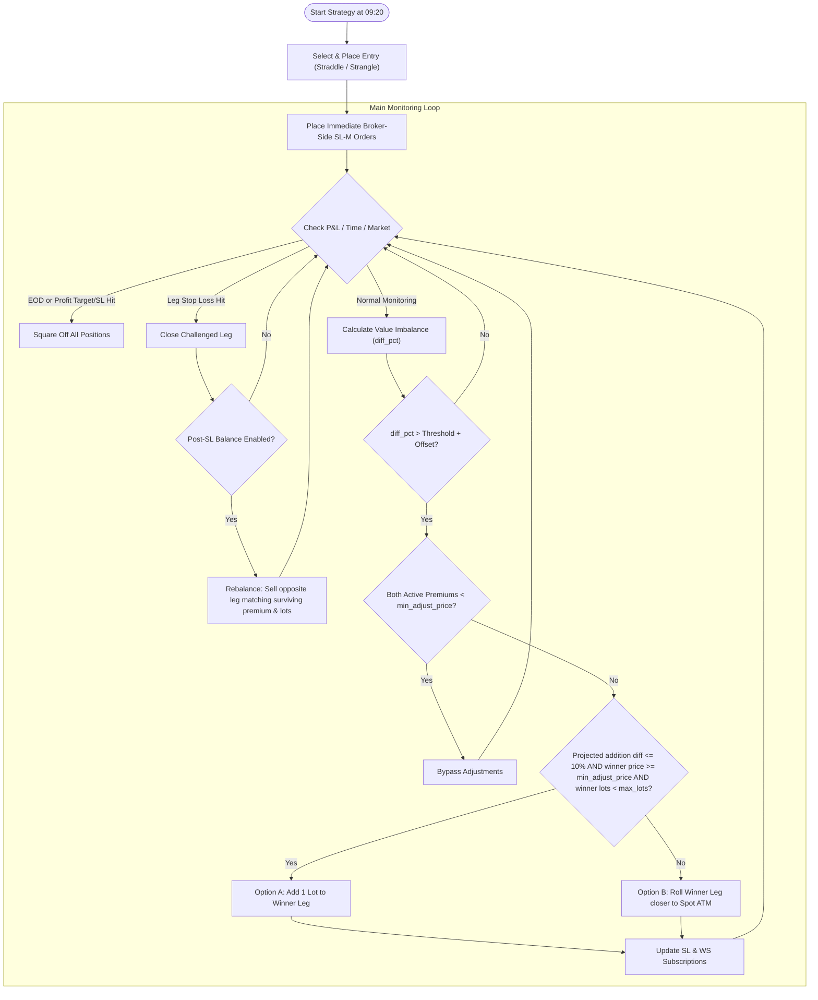

# Nifty Expiry (0DTE) Strategy

The Nifty Expiry Strategy (`strategies/expiry/nifty_expiry.py`) implements a rule-based **0DTE (0 Days to Expiry)** option selling strategy on Nifty index options. Designed specifically for expiry days, the strategy seeks to collect rapid theta decay while dynamically balancing value imbalances and leveraging broker-side stop losses to hedge against sudden moves (Gamma risk).

---

## 1. Strategy Overview & Execution Flow



### A. Entry Selection
Launched at market entry time (default: `09:20 AM` IST):
*   **ATM Straddle**: Rounds the Nifty spot price to the nearest `50` increment and sells the corresponding ATM Call (CE) and Put (PE) options.
*   **OTM Strangle**: Selects strikes based on one of three methods:
    1.  **Distance Mode** (Default): Fixed point offset above/below spot (e.g., `--ce-offset 100 --pe-offset 100`).
    2.  **Premium Mode** (via `--premium`): Selects OTM strikes with premiums closest to, but below, a target price (default: `₹50.00` via `--target-premium`).
    3.  **Delta Mode** (via `--delta`): Selects OTM strikes whose absolute delta is closest to a target delta (default: `0.20` via `--target-delta`).

### B. Broker-Side Stop Losses
To protect against high volatility, the strategy fetches execution prices and immediately places **broker-side Stop-Loss Market (SL-M) orders** (default: `+40%` of entry premium via `--leg-sl-pct 40.0`).

### C. Value Imbalance Monitoring (`winner_addition`)
The strategy tracks the value difference (`diff_pct`) between the CE and PE positions:

$$\text{diff\_pct} = \frac{|\text{CE\_lots} \times \text{CE\_ltp} - \text{PE\_lots} \times \text{PE\_ltp}|}{\max(\text{CE\_val}, \text{PE\_val})} \times 100$$

If the imbalance exceeds the trigger threshold (e.g., `50.0%` + initial entry imbalance offset), the strategy executes:
1.  **Double-Leg Decay Protection**: If **both** active option premiums have decayed below `--min-adjust-price` (default: `₹10.00`), adjustments are bypassed to avoid chasing low premium options.
2.  **Projected Addition Pre-Check**: Evaluates the projected value difference if we add 1 lot of the current winning (cheaper) option:
    *   **Option A (Lot Addition)**: If the projected difference is $\le 10\%$, the winner LTP is $\ge \text{min\_adjust\_price}$ (default: `10.0`), and the winner leg has **not reached** `--max-lots` (default: `4`), the strategy sells `1` additional lot on the same strike. It averages down the entry price and replaces the broker-side SL order.
    *   **Option B (Winner Roll Closer)**: If the projected difference is $> 10\%$, the winner LTP is $< \text{min\_adjust\_price}$ (too cheap to add lots), or the winner leg has already reached `--max-lots`, the strategy **buys to close the current winner leg and rolls it closer to spot ATM**:
        *   Sells the new closer strike with current winner lots quantity (capped at `max_lots`).
        *   Ensures the new strike's value matches the challenged leg within 10% ($\ge 90\%$ of challenged leg value).
        *   Strictly enforces `CE strike > PE strike` to prevent strike inversion.
        *   Replaces WebSocket subscriptions and places a new broker-side SL order.

### D. Post-SL Management
*   **Default Behavior**: When one leg hits its stop-loss, it is closed, realizing a capped loss. The surviving leg runs unadjusted with its original SL.
*   **Strangle Rebalancing Behavior (via `--post-sl-balance`)**: When enabled, the strategy automatically re-enters the stopped-out side by selling a new option contract. It selects the strike whose current premium matches the surviving leg's LTP, using the **exact lot quantity** of the surviving leg. This resets the stopped leg's status, updates subscriptions, places a new broker-side SL order, and recalculates the baseline imbalance to resume normal double-leg monitoring.

---

## 2. Command Line Parameters Reference

| CLI Parameter | Type / Choices | Default | Description |
| :--- | :--- | :--- | :--- |
| **`--live`** | *Flag (Boolean)* | `False` | Run with live order execution. If omitted, runs in dry run simulation mode. |
| **`--lots`** | *Integer* | `1` | Initial lots traded per leg. |
| **`--entry-type`** | `straddle`<br>`strangle` | `straddle` | Selects entry position type. |
| **`--ce-offset`** | *Integer* | `100` | Points above spot for CE strike (distance strangle mode). |
| **`--pe-offset`** | *Integer* | `100` | Points below spot for PE strike (distance strangle mode). |
| **`--delta`** | *Flag (Boolean)* | `False` | Use delta-based strike selection for strangle mode. |
| **`--target-delta`** | *Float* | `0.20` | Target absolute delta in delta strangle mode. |
| **`--premium`** | *Flag (Boolean)* | `False` | Use premium-based strike selection for strangle mode. |
| **`--target-premium`** | *Float* | `50.0` | Target option premium in premium strangle mode. |
| **`--leg-sl-pct`** | *Float* | `40.0` | Stop-loss percentage per individual leg (e.g. `40.0` = 40%). |
| **`--adjustment`** | `c2c`<br>`roll_closer`<br>`restrangle`<br>`winner_addition`<br>`none` | `c2c` | Adjustment mode to apply to the positions. |
| **`--min-adjust-price`**| *Float* | `10.0` | Minimum option price below which lot addition is bypassed and roll closer is triggered. |
| **`--post-sl-balance`** | *Flag (Boolean)* | `False` | Rebalances stopped-out leg to match surviving leg's current premium and lots. |
| **`--max-lots`** | *Integer* | `4` | Maximum lots permitted per leg in `winner_addition` mode. |
| **`--target-profit`** | *Float* | `4000.0` | Global daily profit target in INR. |
| **`--stop-loss`** | *Float* | `4000.0` | Global daily stop loss in INR. |
| **`--start-time`** | *String* | `09:20` | Market start monitoring time (HH:MM IST). |
| **`--eod-time`** | *String* | `15:15` | EOD auto-square-off time (HH:MM IST). |

---

## 3. Numeric Examples

### Example A: Option B (Winner Roll Closer - Failed Projected Addition)
1.  **Initial Entry**:
    *   **CE 24,100**: Sold 1 lot @ ₹80.00 (Value: ₹5,200)
    *   **PE 24,100**: Sold 1 lot @ ₹55.00 (Value: ₹3,575)
    *   **Initial Baseline Offset (`entry_diff_pct`)**:
        $$\text{entry\_diff\_pct} = \frac{|5200 - 3575|}{\max(5200, 3575)} \times 100 = 31.25\%$$
    *   **Active Trigger Threshold**:
        $$\text{Active Threshold} = \text{imbalance\_threshold }(50.0\%) + \text{entry\_diff\_pct }(31.25\%) = 81.25\%$$

2.  **Market Shift & Threshold Check**:
    *   CE LTP rises to **₹95.00** (Value: ₹6,175).
    *   PE LTP decays to **₹10.50** (Value: ₹682.50).
    *   **Current Imbalance (`diff_pct`)**:
        $$\text{diff\_pct} = \frac{|6175 - 682.50|}{6175} \times 100 = 88.95\%$$
    *   **Trigger Verification**:
        Since `diff_pct` ($88.95\%$) $>$ `Active Threshold` ($81.25\%$), the imbalance check triggers.

3.  **Projected Addition Check**:
    *   Evaluating projected PE value if we add 1 lot (2 lots total):
        $$\text{projected\_PE\_val} = 2 \text{ lots} \times \text{₹}10.50 \times 65 = \text{₹}1,365$$
        $$\text{projected\_diff\_pct} = \frac{|6175 - 1365|}{6175} \times 100 = 77.89\%$$
    *   **Decision**:
        Since `projected_diff_pct` ($77.89\%$) is $> 10\%$, a simple lot addition would not balance the system.
    *   **Final Action**: Bypasses lot addition and triggers **Option B (Winner Roll Closer)**.

---

### Example B: Option A (Lot Addition - Successful Check)
1.  **Initial Entry**:
    *   **CE 24,100**: Sold 1 lot @ ₹80.00 (Value: ₹5,200)
    *   **PE 24,100**: Sold 1 lot @ ₹70.00 (Value: ₹4,550)
    *   **Initial Baseline Offset (`entry_diff_pct`)**:
        $$\text{entry\_diff\_pct} = \frac{|5200 - 4550|}{5200} \times 100 = 12.5\%$$
    *   **Active Trigger Threshold**:
        $$\text{Active Threshold} = 50.0\% + 12.5\% = 62.5\%$$

2.  **Market Shift & Threshold Check**:
    *   CE LTP rises to **₹90.00** (Value: ₹5,850).
    *   PE LTP decays to **₹42.00** (Value: ₹2,730).
    *   **Current Imbalance (`diff_pct`)**:
        $$\text{diff\_pct} = \frac{|5850 - 2730|}{5850} \times 100 = 53.33\%$$
    *   Assume a shift pushes `diff_pct` above our trigger threshold.

3.  **Projected Addition Check**:
    *   Winner leg is PE. Evaluating projected value for 2 lots total:
        $$\text{projected\_PE\_val} = 2 \text{ lots} \times \text{₹}42.00 \times 65 = \text{₹}5,460$$
        $$\text{projected\_diff\_pct} = \frac{|5850 - 5460|}{5850} \times 100 = 6.67\%$$
    *   **Decision**:
        Since `projected_diff_pct` ($6.67\%$) is $\le 10\%$ and PE LTP ($₹42.00$) is $\ge ₹10.00$, the addition is approved.
    *   **Final Action**: Sells 1 additional lot of **PE 24,100**. PE average entry becomes **₹56.00** with **2 lots** and updated SL.

---

### Example C: Post-SL Strangle Rebalancing (via `--post-sl-balance`)
1.  **Stop Loss Triggered**:
    *   **CE 24,100**: Hits Stop Loss price (₹98.00) and is closed (`ce_sl_hit = True`).
    *   **PE 24,100**: Remains open with **2 lots** (Value: ₹1,950 @ current LTP of ₹15.00).

2.  **Rebalancing Check**:
    *   Since `--post-sl-balance` is enabled and adjustment count ($0$) $<$ max adjustments ($3$), the strategy initiates rebalancing.

3.  **Rebalancing Execution**:
    *   Finds surviving PE leg price (LTP = ₹15.00) and lot size (**2 lots**).
    *   Filters the option chain for CE strikes above the PE strike `24,100` (strictly enforcing `CE > PE`).
    *   Selects **CE 24,250** with closest premium matching surviving leg (LTP = ₹13.50).
    *   Sells **2 lots** (130 shares) of **CE 24,250** at market.
    *   Places a new CE Stop Loss at **₹18.90** (`13.50 * 1.4` rounded).
    *   Resets `ce_sl_hit = False`, allowing normal double-leg monitoring to resume.

4.  **Recalculation of Baseline Offset**:
    *   Updates `self.entry_diff_pct` using the new LTPs:
        *   CE Value: $2 \text{ lots} \times \text{₹}13.50 \times 65 = \text{₹}1,755$
        *   PE Value: $2 \text{ lots} \times \text{₹}15.00 \times 65 = \text{₹}1,950$
        $$\text{new\_entry\_diff\_pct} = \frac{|1950 - 1755|}{1950} \times 100 = 10.0\%$$
    *   **New Active Trigger Threshold**:
        $$\text{New Active Threshold} = 50.0\% + 10.0\% = 60.0\%$$

---

## 4. Execution Guide

> [!IMPORTANT]
> All commands must be run from the project root (`c:\dhan_algo\dhan_algo`) using the virtual environment interpreter.

### Activate Virtual Environment
```powershell
c:\dhan_algo\dhan_algo\venv\Scripts\activate
```

### Dry Run Simulations (Safe — No Real Orders)

*   **Default Straddle Entry with Winner Addition**:
    ```powershell
    python strategies/expiry/nifty_expiry.py --adjustment winner_addition
    ```
*   **Straddle Entry with Winner Addition and Post-SL Rebalancing**:
    ```powershell
    python strategies/expiry/nifty_expiry.py --adjustment winner_addition --post-sl-balance
    ```
*   **Strangle Entry (Distance Mode) with Winner Addition**:
    ```powershell
    python strategies/expiry/nifty_expiry.py --entry-type strangle --ce-offset 150 --pe-offset 150 --adjustment winner_addition --min-adjust-price 10.0
    ```
*   **Strangle Entry (Premium Mode) with Cost-to-Cost (C2C) Adjustment**:
    ```powershell
    python strategies/expiry/nifty_expiry.py --entry-type strangle --premium --target-premium 45.0 --adjustment c2c
    ```

### Live Trading (Real Orders)

*   **Live Straddle (Winner Addition, 1 lot, max 4 lots)**:
    ```powershell
    python strategies/expiry/nifty_expiry.py --live --lots 1 --entry-type straddle --adjustment winner_addition --max-lots 4
    ```
*   **Live Strangle with Winner Addition and Post-SL Rebalancing**:
    ```powershell
    python strategies/expiry/nifty_expiry.py --live --lots 1 --entry-type strangle --premium --target-premium 50.0 --adjustment winner_addition --max-lots 4 --min-adjust-price 10.0 --post-sl-balance
    ```
