# Nifty Value-Imbalance Strategies

This document covers all option selling strategies in `strategies/value_imbalance/`:
1.  **Nifty Advanced Value-Imbalance Straddle & Strangle** (`nifty_advanced_imbalance.py`)
2.  **Nifty Value-Imbalance Straddle** (`nifty_value_imbalance_straddle.py`)
3.  **Nifty Value-Imbalance Strangle** (`nifty_value_imbalance_strangle.py`)
4.  **Nifty 1-Min VWAP Straddle** (`nifty_vwap_1min_straddle.py`)
5.  **Nifty Delta Neutral (0.5 Delta)** (`nifty_delta_neutral.py`)
6.  **Nifty VIX-Filtered Straddle** (`nifty_vix_straddle.py`)

---

## 1. Core Mechanics & Mathematical Formulas

The value-imbalance framework seeks to maintain premium balance (and therefore delta neutrality) in a short option portfolio by dynamically adjusting legs as the underlying market trends.


### A. Mathematical Definitions

*   **Premium Value**:
    $$\text{Value}_{\text{leg}} = \text{Lots}_{\text{leg}} \times \text{LTP}_{\text{leg}}$$
*   **Imbalance Percentage (`diff_pct`)**:
    $$\text{diff\_pct} = \frac{|\text{CE\_val} - \text{PE\_val}|}{\max(\text{CE\_val}, \text{PE\_val})} \times 100$$
*   **Active Trigger Threshold**:
    $$\text{Active Threshold} = \text{Threshold}_{\text{Lot/Strike}} + \text{entry\_diff\_pct}$$
    *(where `entry_diff_pct` is the initial imbalance offset recorded at entry)*

---

## 2. Strategy Phases (Legacy Straddle & Strangle)

The standard straddle (`nifty_value_imbalance_straddle.py`) and strangle (`nifty_value_imbalance_strangle.py`) strategies operate in five distinct phases:

### Phase 1: Initialization & ATM Selection
*   Fetches the current Nifty spot price.
*   Identifies ATM strike (for straddle) or OTM strikes (for strangle).
*   Resolves contract IDs and fetches current lot sizes dynamically.

### Phase 2: Balanced Entry Check
*   Monitors premium prices.
*   Triggers entry only when the premium difference is below the threshold (default: `< 15.0%` for straddle, `< 25.0%` for strangle).

### Phase 3: Value Balancing (Lot Addition)
*   If the market trends and `diff_pct` exceeds the `threshold_lot` (default: `25.0%` + entry offset):
    *   Sells `1` additional lot on the **Winner** (cheaper, decaying) leg.
    *   Averages down the entry price and collects more theta decay to offset the losing leg.
    *   Repeats until `max_lots` (default: `4`) is reached.

### Phase 4: Single-Leg Strike Adjustment
*   If `max_lots` is reached and `diff_pct` exceeds `threshold_strike` (default: `40.0%` + entry offset):
    *   Shifts the **Loser** (expensive, challenged) leg to a further OTM strike.
    *   Selects a new strike such that:
        $$\text{New\_Lots} \times \text{New\_Price} \approx \text{Current\_Value}_{\text{winner}}$$
    *   This resets the risk of the challenged leg without squaring off the entire trade.

### Phase 5: Straddle Shift (Cycle Reset)
*   **Straddle**: If the current ATM strike shifts by **$\ge$ 100 points** from the original entry strike (e.g. when spot reaches `initial_atm + 75` or `initial_atm - 75`, causing the ATM to change by 100 points), the entire trade is squared off, pauses for 5 minutes, and restarts.
*   **Strangle**: If spot breaches the outer strike boundaries, exits all positions, pauses 5 minutes, and restarts a fresh strangle.

---

## 3. Advanced Strategy Mode Variations (`nifty_advanced_imbalance.py`)

The advanced script introduces selectable adjustment logic modes to optimize margin efficiency and hedge tail risk:

### A. `winner_roll_atm` (Default)
*   **Action**: Checks the value of the losing leg and chooses the appropriate strike to balance the winner leg's premium against that value, maintaining a flat 1:1 lot ratio.
*   **Trigger threshold**: Configurable via `--threshold-lot` (default `25.0`, i.e. 25%). The roll fires when the current premium imbalance exceeds `threshold_lot + entry_diff_pct`, where `entry_diff_pct` is the baseline skew captured at entry and recalculated after each adjustment.
*   **Benefit**: Eliminates margin inflation by keeping lot counts static.
*   **Inversion Prevention**: Strictly enforces `CE strike > PE strike`. If a roll would cross strikes, it triggers an emergency cycle exit.

### B. `loser_ratio_roll`
*   **Action**: Rolls the challenged loser leg further OTM and increments quantity (ratio spread) to maintain premium collections.
*   **Benefit**: Highly configurable lot increment size (default: `1` lot increment via `--loser-ratio-lots`).

### C. `hedged_addition`
*   **Action**: Adds short lots to the winner leg (like legacy) but buys further OTM options (200 pts out) to hedge against market whipsaws.
*   **Benefit**: Limits potential reversal losses to:
    $$\text{Max Wing Loss} = \text{Strike Difference (200)} - \text{Net Credit Added}$$

### D. `legacy`
*   **Action**: Original unhedged winner lot addition strategy.

### E. `reentry_straddle` (Straddle-only)
*   **Action**: Sells ATM CE + PE. Skips the value-imbalance lot-addition/strike-shift logic (Phases 3-4) entirely — each leg is instead managed independently:
    *   Each leg gets its own SL: `leg_sl = entry_price \times (1 + \text{leg\_sl\_pct})` (default `--leg-sl-pct 0.20` → SL at 120% of entry premium).
    *   When a leg's SL is hit, only that leg is bought back and marked flat; the other leg keeps running untouched.
    *   The flat leg **re-enters** (fresh sell at the initial lot size) once its LTP drops back to `<=` its original entry premium.
*   **Constraint**: Requires `--entry-type straddle` — the strategy errors out at startup if used with `--entry-type strangle`.
*   **`--max-lots` has no effect** in this mode (always re-enters at the initial lot size; no lot scaling), and the strategy errors if a non-default value is passed.
*   Global `--target-profit` / `--stop-loss` and the trailing SL (`--trail-start-pct` / `--trail-gap-pts`) still apply on top, computed from combined CE+PE LTP regardless of each leg's active/flat state. The straddle-shift cycle-reset (§2 Phase 5) also still applies.
*   **Benefit**: Turns a directional move against one leg into an independent, repeatable per-leg SL/re-entry cycle instead of averaging down or rolling strikes — useful for choppy/range-bound days where a leg may get stopped and re-triggered multiple times.

---

## 4. CLI Parameters Reference

### A. Nifty Advanced Value-Imbalance Strategy (`nifty_advanced_imbalance.py`)

| CLI Flag | Default | Description |
| :--- | :--- | :--- |
| **`--live`** | *Flag* | Enable real order placement (defaults to dry-run mode). |
| **`--lots N`** | `1` | Initial lots per leg. |
| **`--mode MODE`** | `winner_roll_atm` | Selects adjustment mode (`winner_roll_atm`, `loser_ratio_roll`, `hedged_addition`, `legacy`, `reentry_straddle`). |
| **`--threshold-lot PCT`** | `25.0` | *(winner_roll_atm only, applies while below `--max-lots`)* Base premium imbalance % — added to the post-entry/post-roll `entry_diff_pct` baseline — that triggers a winner-roll adjustment. |
| **`--threshold-strike PCT`** | `40.0` | *(applies once `--max-lots` is reached)* Premium imbalance % that triggers a strike shift. Must be > `--threshold-lot`. |
| **`--scalp-floor-pct PCT`** | `0.0` | Combined premium decay % that triggers an immediate Scalp Lock profit exit (e.g. `30.0` = 30% decay captured). Default `0.0` (disabled). |
| **`--multi-cycle`** | *Flag* | Auto-restarts a fresh ATM cycle after a Scalp Lock or profit target exit (enabling continuous intraday scalping). |
| **`--cycle-cooldown SEC`** | `300` | Cooldown period in seconds between scalp cycles before placing the next entry. |
| **`--loser-ratio-lots N`** | `1` | Number of lots to increment during a loser ratio roll adjustment. |
| **`--leg-sl-pct PCT`** | `0.20` | *(reentry_straddle only)* Per-leg SL as a fraction of entry premium (e.g. `0.20` = SL at 120% of entry price). |
| **`--trail-start-pct PCT`** | `5.0` | Arms the trailing stop-loss once profit reaches this % of the entry combined premium. |
| **`--trail-gap-pts PTS`** | `15.0` | Once armed, exits if the combined premium rises this many points above its best (lowest) level since arming. |
| **`--entry-type TYPE`** | `straddle` | Entry position type (`straddle`, `strangle`). |
| **`--delta`** | *Flag* | Use delta-based strike selection for strangle. |
| **`--target-delta D`** | `0.20` | Target absolute delta in delta strangle mode. |
| **`--premium`** | *Flag* | Use premium-based strike selection for strangle. |
| **`--target-premium PREM`** | `50.0` | Target premium in premium strangle mode. |
| **`--ce-offset PTS`** | `200` | Points above spot for CE strike in distance strangle. |
| **`--pe-offset PTS`** | `200` | Points below spot for PE strike in distance strangle. |
| **`--target-profit AMT`** | `4000.0` | Global daily profit target in ₹. |
| **`--stop-loss AMT`** | `4000.0` | Global daily stop loss in ₹. |
| **`--start-time TIME`** | `09:20` | Market start monitoring time (HH:MM IST). |

### B. Nifty Value-Imbalance Straddle Strategy (`nifty_value_imbalance_straddle.py`)

| CLI Flag | Default | Description |
| :--- | :--- | :--- |
| **`--live`** | *Flag* | Enable real order placement (defaults to dry-run mode). |
| **`--lots N`** | `1` | Initial lots per leg. |
| **`--target-profit AMT`** | `4000.0` | Global daily profit target in ₹. |
| **`--stop-loss AMT`** | `4000.0` | Global daily stop loss in ₹. |
| **`--start-time TIME`** | `09:20` | Market start monitoring time (HH:MM IST). |
| **`--entry-balance-threshold PCT`** | `15.0` | Initial balance threshold percentage for entry. |
| **`--trail-start-pct PCT`** | `5.0` | Arms the trailing stop-loss once profit reaches this % of the entry combined premium. |
| **`--trail-gap-pts PTS`** | `15.0` | Once armed, exits if the combined premium rises this many points above its best (lowest) level since arming. |

### C. Nifty Value-Imbalance Strangle Strategy (`nifty_value_imbalance_strangle.py`)

| CLI Flag | Default | Description |
| :--- | :--- | :--- |
| **`--live`** | *Flag* | Enable real order placement (defaults to dry-run mode). |
| **`--lots N`** | `1` | Initial lots per leg. |
| **`--delta`** | *Flag* | Use delta-based strike selection. |
| **`--distance`** | *Flag* | Use fixed-point offset strike selection (default). |
| **`--premium`** | *Flag* | Use premium-based strike selection. |
| **`--ce-offset PTS`** | `200` | Points above spot for CE strike. |
| **`--pe-offset PTS`** | `200` | Points below spot for PE strike. |
| **`--target-delta D`** | `0.20` | Target absolute delta in delta mode. |
| **`--target-premium PREM`** | `50.0` | Target premium in premium mode. |
| **`--target-profit AMT`** | `4000.0` | Global daily profit target in ₹. |
| **`--stop-loss AMT`** | `4000.0` | Global daily stop loss in ₹. |
| **`--start-time TIME`** | `09:20` | Market start monitoring time (HH:MM IST). |

---

## 5. Execution Examples

> [!IMPORTANT]
> All commands must be executed from the project root directory (`c:\dhan_algo\dhan_algo`) using the virtual environment python interpreter (`venv\Scripts\python.exe`).

### Activate Virtual Environment (One-time per terminal session)
```powershell
c:\dhan_algo\dhan_algo\venv\Scripts\activate
```

---

### A. Nifty Advanced Straddle & Strangle (`nifty_advanced_imbalance.py`)

#### 1. Dry Run Simulations (Safe — No Orders Placed)
*   **Straddle with Winner Roll (Default mode, 1 lot initial)**:
    ```powershell
    venv\Scripts\python.exe strategies/value_imbalance/nifty_advanced_imbalance.py --entry-type straddle --mode winner_roll_atm
    ```
*   **Strangle (Distance offset, Hedged Addition, 1 lot, custom offset)**:
    ```powershell
    venv\Scripts\python.exe strategies/value_imbalance/nifty_advanced_imbalance.py --entry-type strangle --ce-offset 150 --pe-offset 250 --mode hedged_addition
    ```
*   **Strangle (Delta-based selection, Winner Roll, target delta 0.15)**:
    ```powershell
    venv\Scripts\python.exe strategies/value_imbalance/nifty_advanced_imbalance.py --entry-type strangle --delta --target-delta 0.15 --mode winner_roll_atm
    ```
*   **Strangle (Premium-based selection, Loser Ratio Roll, target premium <= 35, 1 lot increment)**:
    ```powershell
    venv\Scripts\python.exe strategies/value_imbalance/nifty_advanced_imbalance.py --entry-type strangle --premium --target-premium 35 --mode loser_ratio_roll --loser-ratio-lots 1
    ```

#### 2. Live Trading (Real Orders)
*   **Live Straddle (Winner Roll, 2 lots initial)**:
    ```powershell
    venv\Scripts\python.exe strategies/value_imbalance/nifty_advanced_imbalance.py --live --lots 2 --entry-type straddle --mode winner_roll_atm
    ```
*   **Live Strangle (Premium-based, Loser Ratio Roll, target premium <= 40, 2-lot increments, custom profit/stop limits)**:
    ```powershell
    venv\Scripts\python.exe strategies/value_imbalance/nifty_advanced_imbalance.py --live --lots 2 --entry-type strangle --premium --target-premium 40 --mode loser_ratio_roll --loser-ratio-lots 2 --target-profit 5000 --stop-loss 3000
    ```
*   **Live Strangle (Delta-based 0.20, Hedged Addition, 1 lot initial, start at 09:25 IST)**:
    ```powershell
    venv\Scripts\python.exe strategies/value_imbalance/nifty_advanced_imbalance.py --live --lots 1 --entry-type strangle --delta --target-delta 0.20 --mode hedged_addition --start-time 09:25 --target-profit 4000 --stop-loss 4000
    ```

---

### B. Nifty Value-Imbalance Strangle Strategy (`nifty_value_imbalance_strangle.py`)

#### 1. Dry Run Simulations (Safe — No Orders Placed)
*   **Symmetric Strangle (Distance mode, CE/PE 200 pt offset, 1 lot)**:
    ```powershell
    venv\Scripts\python.exe strategies/value_imbalance/nifty_value_imbalance_strangle.py --ce-offset 200 --pe-offset 200
    ```
*   **Asymmetric Strangle (Distance mode, tighter CE offset 150 pt, wider PE offset 300 pt)**:
    ```powershell
    venv\Scripts\python.exe strategies/value_imbalance/nifty_value_imbalance_strangle.py --ce-offset 150 --pe-offset 300
    ```
*   **Strangle (Delta mode, target delta 0.20)**:
    ```powershell
    venv\Scripts\python.exe strategies/value_imbalance/nifty_value_imbalance_strangle.py --delta --target-delta 0.20
    ```
*   **Strangle (Premium mode, target premium <= 50.0)**:
    ```powershell
    venv\Scripts\python.exe strategies/value_imbalance/nifty_value_imbalance_strangle.py --premium --target-premium 50.0
    ```

#### 2. Live Trading (Real Orders)
*   **Live Symmetric Strangle (Distance mode, 200 pt offset, 1 lot)**:
    ```powershell
    venv\Scripts\python.exe strategies/value_imbalance/nifty_value_imbalance_strangle.py --live
    ```
*   **Live Strangle (Distance mode, wider 300 pt offset, 2 lots, custom profit/loss target)**:
    ```powershell
    venv\Scripts\python.exe strategies/value_imbalance/nifty_value_imbalance_strangle.py --live --lots 2 --ce-offset 300 --pe-offset 300 --target-profit 6000 --stop-loss 3000
    ```
*   **Live Strangle (Delta mode, target delta 0.15, 2 lots)**:
    ```powershell
    venv\Scripts\python.exe strategies/value_imbalance/nifty_value_imbalance_strangle.py --live --lots 2 --delta --target-delta 0.15
    ```
*   **Live Strangle (Premium mode, target premium <= 35.0, 1 lot, start at 09:25 IST)**:
    ```powershell
    venv\Scripts\python.exe strategies/value_imbalance/nifty_value_imbalance_strangle.py --live --premium --target-premium 35 --start-time 09:25
    ```

---

### C. Nifty Value-Imbalance Straddle Strategy (`nifty_value_imbalance_straddle.py`)

#### 1. Dry Run Simulations (Safe — No Orders Placed)
*   **ATM Straddle (Default settings, 1 lot)**:
    ```powershell
    venv\Scripts\python.exe strategies/value_imbalance/nifty_value_imbalance_straddle.py
    ```
*   **ATM Straddle (Custom entry balance threshold of 10%)**:
    ```powershell
    venv\Scripts\python.exe strategies/value_imbalance/nifty_value_imbalance_straddle.py --entry-balance-threshold 10
    ```

#### 2. Live Trading (Real Orders)
*   **Live ATM Straddle (Default settings, 2 lots)**:
    ```powershell
    venv\Scripts\python.exe strategies/value_imbalance/nifty_value_imbalance_straddle.py --live --lots 2
    ```
*   **Live ATM Straddle (Custom risk targets, custom start time 09:25 IST)**:
    ```powershell
    venv\Scripts\python.exe strategies/value_imbalance/nifty_value_imbalance_straddle.py --live --lots 1 --target-profit 5000 --stop-loss 3000 --start-time 09:25
    ```
*   **Live ATM Straddle (Tighter initial entry balance threshold of 5%)**:
    ```powershell
    venv\Scripts\python.exe strategies/value_imbalance/nifty_value_imbalance_straddle.py --live --entry-balance-threshold 5
    ```

---

## 6. Detailed Trade Flow Examples

Here are step-by-step examples of how trades flow under different market conditions.

### Scenario A: Symmetrical Decay & Target Exit (No Adjustments)
1.  **Selection & Balanced Entry**: 
    *   Nifty Spot is `24,015`. Rounding to nearest `50` yields `24,000` ATM strike.
    *   `24000 CE` trades @ ₹120; `24000 PE` trades @ ₹115.
    *   Difference = $(120 - 115) / 120 \times 100 = 4.17\%$. Since $4.17\% < 15.0\%$ entry threshold, the trade is entered (Sell 1 lot CE @ ₹120, Sell 1 lot PE @ ₹115).
    *   Initial `entry_diff_pct` offset is recorded as `4.17%`.
2.  **Symmetrical Market Decay**:
    *   Market ranges between `23,980` and `24,020` for two hours.
    *   `24000 CE` decays to ₹80; `24000 PE` decays to ₹75.
    *   Combined unrealized profit: $(120 - 80 + 115 - 75) \times 75 \text{ (lot size)} = \mathbf{₹6,000}$ (assuming Nifty lot size is 75).
3.  **Target Reached & Square Off**:
    *   Total P&L (₹6,000) exceeds target profit limit of ₹4,000.
    *   The strategy executes market buy back orders to close both legs and terminates for the day.

---

### Scenario B: Dynamic Lot Addition (Martingale Balancing)
1.  **Entry Setup**: 
    *   Short 1 lot `24000 CE` @ ₹120; Short 1 lot `24000 PE` @ ₹115. Offset: `4.17%`.
    *   Lot addition trigger threshold: $25\% + 4.17\% = \mathbf{29.17\%}$.
2.  **Market Trending Move**:
    *   Spot climbs to `24,070`.
    *   `24000 CE` spikes to ₹170 (Value: ₹170).
    *   `24000 PE` decays to ₹70 (Value: ₹70).
    *   Imbalance = $(170 - 70) / 170 \times 100 = 58.82\%$. This breaches the $29.17\%$ trigger.
3.  **Adjustment (Lot Addition)**:
    *   Leg count ($1$) is less than `max_lots` ($4$).
    *   Sells `1` additional lot on the winning (cheaper) side: `24000 PE` @ ₹70.
    *   PE Avg Price is updated to: $(115 + 70) / 2 = \mathbf{₹92.50}$ (2 lots).
    *   Baseline offset `entry_diff_pct` is recalculated:
        $$\text{CE Value} = 1 \times 170 = 170$$
        $$\text{PE Value} = 2 \times 70 = 140$$
        $$\text{new\_entry\_diff\_pct} = \frac{170 - 140}{170} \times 100 = 17.65\%$$
    *   Active trigger threshold becomes: $25\% + 17.65\% = \mathbf{42.65\%}$.
4.  **Subsequent Monitoring**:
    *   Market stabilizes. The 2 lots of `24000 PE` decay twice as fast, neutralizing the risk of the challenged CE.

---

### Scenario C: OTM Winner Rolling (`winner_roll_atm` Mode)
1.  **Entry Setup**: 
    *   Short 1 lot `24000 CE` @ ₹120; Short 1 lot `24000 PE` @ ₹115. Offset: `4.17%`.
    *   Trigger threshold: $25\% + 4.17\% = \mathbf{29.17\%}$.
2.  **Market Trending Move**:
    *   Spot climbs to `24,070`.
    *   `24000 CE` spikes to ₹170; `24000 PE` decays to ₹70. Imbalance = $58.82\% > 29.17\%$.
3.  **Adjustment (Winner Value-Balanced Roll)**:
    *   Instead of adding lots or rolling blindly to ATM, the strategy checks the value of the losing PE leg (1 lot * ₹170 = ₹170) and selects the PE strike whose value matches ₹170.
    *   Action: Buys to close `24000 PE` @ ₹70 (Realized Profit: +₹45).
    *   Action: Queries option chain for the PE strike trading closest to ₹170 (e.g., `24050 PE` @ ₹105).
    *   Action: Sells 1 lot `24050 PE` @ ₹105.
    *   New Position: `24000 CE` (1 lot @ avg ₹120) & `24050 PE` (1 lot @ avg ₹105).
    *   Premium balance is restored with zero margin inflation.

---

### Scenario D: Straddle Shift (Cycle Reset)
1.  **Entry Setup**: 
    *   Initial Nifty Spot is `24,015`. Sells `24000 CE` & `24000 PE` ATM Straddle.
    *   Initial ATM strike `initial_ce_strike` is recorded as `24,000`.
2.  **Market Trending Move**:
    *   Heavy buying pushes Nifty Spot to `24,076`.
    *   The current spot ATM strike becomes `24,100` (since `int(round(24076 / 50) * 50) = 24100`).
3.  **Cycle Reset Trigger**:
    *   The strategy calculates `current_atm` as `24,100`.
    *   The strike shift distance is:
        $$\text{Shift Distance} = |24100 - 24000| = \mathbf{100\text{ points}}$$
    *   Since the ATM strike has shifted by $\ge 100$ points (meaning the strike that was originally 100 points above the initial ATM has now become the current ATM), the shift triggers.
    *   **Action**: Immediately buys to close all active straddle positions (`24000 CE` and `24000 PE`) to protect against extreme directional moves.
    *   Pauses for **5 minutes** (cooldown) and then restarts a fresh cycle at the new ATM strike (`24,100`).

---

### Scenario E: Trailing Stop Loss (`--trail-start-rs` / `--trail-gap-rs`)

Applies to `nifty_value_imbalance_straddle.py` (§4.B), `nifty_value_imbalance_strangle.py`, `nifty_delta_neutral.py`, and `nifty_advanced_imbalance.py` (§4.A, any mode). The trail runs on **rupee MTM** — the same `total_pnl` figure the profit target and global SL use, which already folds in `realized_pnl`. That matters: every roll, lot addition and leg close is absorbed automatically, so there is no baseline to go stale after an adjustment.

$$\text{armed when} \quad \text{total\_pnl} \ge \text{trail\_start\_rs}$$
$$\text{trail\_exit} = \text{best\_pnl} - \text{trail\_gap\_rs} \quad \text{(only once armed)}$$

1.  **Entry**: Sell `24000 CE` + `24000 PE`, 2 lots each. MTM starts near zero.
2.  **Arming**: With defaults (`trail_start_rs=500`, `trail_gap_rs=300`), MTM decays up to `+₹620` → trail activates, `best_pnl = 620`, exit level `620 − 300 = ₹320`.
3.  **Trailing up**: MTM keeps improving to `+₹1,150` → `best_pnl` updates to `1150` (it only ever moves up). Exit level rises to `₹850`.
4.  **Exit**: If MTM falls back below `₹850`, the strategy immediately buys back both legs — locking in most of the gain from the best point reached, rather than giving it all back.
5.  **Across a roll**: a winner roll books its leg into `realized_pnl` and re-shorts at a new strike. `total_pnl` is continuous through that, so `best_pnl` carries forward and the trail keeps working — unlike the old points-based version, which compared new strikes against the original entry premium and went permanently dormant after the first adjustment.

The trail is skipped while both legs are flat (`ce_lots == 0 and pe_lots == 0`), which matters in `reentry_straddle` mode where `total_pnl` is pure realized P&L between re-entries.

Set `--trail-start-rs 0` to arm immediately on entry; raise `--trail-gap-rs` for more room on choppy days, or tighten it to lock in profit faster. Size both against your lot count — the defaults suit 2 lots of NIFTY.

---

### Scenario F: Per-Leg SL & Re-entry (`--mode reentry_straddle`)

Applies to `nifty_advanced_imbalance.py --entry-type straddle --mode reentry_straddle` only (not available for strangle). Each leg is watched and traded independently — a stopped-out leg doesn't wait for the other leg or for a full cycle reset; it re-enters on its own once premium comes back down.

1.  **Entry Setup**: Sell `24000 CE` @ ₹120 + `24000 PE` @ ₹115 (1 lot each). With default `--leg-sl-pct 0.20`:
    *   `ce_sl = 120 × 1.20 = 144`
    *   `pe_sl = 115 × 1.20 = 138`
2.  **CE Leg Stopped Out**: Spot rallies, `24000 CE` LTP rises to `146` → `>= ce_sl (144)`.
    *   **Action**: Buys back `24000 CE` at ~₹146. Realized loss on this leg: `(120 − 146) × lot_size`.
    *   CE is now flat; `ce_original_entry_premium` stays recorded at `120`. PE leg is untouched and keeps running with its own SL at `138`.
3.  **CE Re-entry**: Market cools off, `24000 CE` LTP drifts back down to `118` → `<= ce_original_entry_premium (120)`.
    *   **Action**: Sells `24000 CE` again at ~₹118, at the *initial* lot size (1 lot — `--max-lots` has no effect here).
    *   New `ce_sl = 118 × 1.20 = 141.6`. The cycle can repeat any number of times through the session.
4.  **Meanwhile**: Global `--target-profit`/`--stop-loss` and the trailing SL (Scenario E) are still evaluated every tick against combined CE+PE LTP, and the straddle-shift cycle reset (Scenario D) still applies if spot moves the ATM by 100+ points — any of these can end the whole cycle regardless of individual leg state.

Raise `--leg-sl-pct` (e.g. `0.30`) to give each leg more room before it's stopped out; lower it (e.g. `0.15`) for tighter per-leg risk control at the cost of more frequent stop-outs/re-entries.

---

## 7. Nifty 1-Min VWAP Straddle (`nifty_vwap_1min_straddle.py`)

A mean-reversion short straddle that uses the **true Volume-Weighted Average Price of the combined straddle premium** (CE + PE), computed from 1-minute OHLCV candles fetched via the Dhan API. There are no lot additions or strike adjustments — each cycle is a simple sell → monitor → exit → repeat loop.

### A. Concept & VWAP Calculation

At the start of every new completed 1-minute bar, the strategy re-fetches intraday candles for both CE and PE legs, merges them on timestamp, builds a combined straddle OHLCV series, and recomputes the session VWAP from the session open (09:15 IST):

$$\text{VWAP} = \frac{\sum(\text{TP}_i \times V_i)}{\sum V_i}$$

where:
- $\text{TP}_i = \frac{(\text{CE\_High}_i + \text{PE\_High}_i) + (\text{CE\_Low}_i + \text{PE\_Low}_i) + (\text{CE\_Close}_i + \text{PE\_Close}_i)}{3}$ — combined straddle typical price per bar
- $V_i = \frac{\text{CE\_Volume}_i + \text{PE\_Volume}_i}{2}$ — average leg volume per bar; zero-volume bars use $V_i = 1$ (TWAP fallback for quiet bars)

A configurable warm-up (`--vwap-warmup-bars`, default 10 bars ≈ 10 min) must elapse before the VWAP is trusted for trade decisions.

The VWAP resets whenever an ATM shift is detected (spot moves to a new 50-point bracket), because the underlying contracts change and the prior price history is no longer relevant.

> **Implementation note**: Candles are fetched with a 2-day window (yesterday → today) to avoid a DH-905 API error that occurs on same-day-only requests.

### B. State Machine

```mermaid
stateDiagram-v2
    [*] --> WarmUp: Session starts, subscribe to ATM CE & PE\nBootstrap VWAP from existing candles
    WarmUp --> Monitoring: vwap_bars >= vwap_warmup_bars
    Monitoring --> InPosition: combined ≤ VWAP + entry_band\nAND declining over decline_ticks WS ticks\nAND |CE−PE| / max < max_premium_diff_pct
    InPosition --> Monitoring: combined > VWAP + exit_buffer\n(buy back both legs)
    InPosition --> InPosition: ATM shifted while in position\n(record pending_atm; hold until exit)
    Monitoring --> WarmUp: ATM shifted while out of position\n(re-subscribe new CE/PE, reset VWAP)
    InPosition --> [*]: Profit target, stop loss, or 15:17 auto-exit
    Monitoring --> [*]: Profit target, stop loss, or 15:17 auto-exit
```



| Phase | Condition | Action |
|---|---|---|
| **Warm-up** | `vwap_bars < vwap_warmup_bars` | Refresh candles each minute; no trading |
| **Entry** | All three gates pass (see §C) | Sell ATM CE + PE |
| **Hold** | `combined ≤ VWAP + exit_buffer` | Stay in position; VWAP refreshes each minute |
| **Exit** | `combined > VWAP + exit_buffer` | Buy back both legs, book PnL; re-enter on next signal |
| **ATM shift (out)** | Spot moves to new 50-pt bracket, no position | Re-subscribe new ATM CE/PE, reset VWAP, warm up again |
| **ATM shift (in)** | Spot moves to new 50-pt bracket, in position | Record pending ATM; re-center only after position is closed |

### C. Entry Conditions

All three gates must pass simultaneously before a position is opened:

1. **VWAP ready** — `vwap_bars >= vwap_warmup_bars`
   Ensures the VWAP has enough history to be a meaningful reference.

2. **Price gate** — `combined_ltp ≤ candle_vwap + entry_band`
   Ensures the straddle is sold at or near its volume-weighted average cost, not during a premium spike.

3. **Decline gate** — `combined_ltp < recent_combined[0]` over the last `decline_ticks` WebSocket ticks
   Requires the combined premium to be falling in the immediate short window, avoiding entries during an upswing.

4. **Balance gate** — `|CE_LTP − PE_LTP| / max(CE_LTP, PE_LTP) × 100 < max_premium_diff_pct`
   Guards against directionally skewed entries where one leg has already moved significantly.

### D. CLI Parameter Reference

| Flag | Default | Description |
|---|---|---|
| `--live` | off (dry run) | Enable real order placement |
| `--lots N` | `1` | Lots per leg (CE and PE symmetric) |
| `--start-time HH:MM` | `09:20` | Session start monitoring time (IST) |
| `--entry-band PTS` | `5` | Max points **above** VWAP at which entry is permitted (`combined ≤ VWAP + entry_band`). |
| `--decline-ticks N` | `5` | WebSocket-tick window: combined premium must be falling vs the oldest value in this window. |
| `--exit-buffer PTS` | `10` | Points **above** VWAP that trigger exit (`combined > VWAP + exit_buffer`). Keep `exit_buffer ≥ entry_band`. |
| `--max-premium-diff PCT` | `15` | Max allowed % difference between CE and PE premiums at entry. |
| `--vwap-warmup-bars N` | `10` | Min completed 1-min bars (≈ 10 min) before VWAP is trusted for trading. |
| `--target-profit INR` | `4000` | Session profit target — strategy pauses until next day once reached. |
| `--stop-loss INR` | `4000` | Session stop loss (positive value) — strategy pauses until next day once total PnL < −stop_loss. |
| `--max-loss-per-trade INR` | `1500` | Hard per-cycle stop-loss, independent of VWAP (`unrealized ≤ −max_loss_per_trade` forces exit). `0` disables. |
| `--max-trades-per-day N` | `15` | Max entries per session; further entries blocked once reached. `0` = unlimited. |
| `--cooldown-seconds N` | `90` | Entries paused for this many seconds after a losing cycle closes. |
| `--max-spread-pct PCT` | `8` | Max bid-ask spread % per leg (via `get_quote_data` depth) to allow entry; skips entry on illiquid strikes. `0` disables. |

### E. Parameter Tuning Guide

**`--entry-band`**
Controls how eagerly the strategy enters. `0` = only enter at or below VWAP. `5` (default) allows entry up to 5 pts above VWAP, capturing the typical oscillation band. Raise to `8–10` on high-IV days when premiums are choppier.

**`--decline-ticks`**
Higher values (e.g., `8–10`) require a longer sustained decline before entry — fewer but higher-conviction trades. Lower values (e.g., `3`) respond faster but may enter during brief dips within an upswing.

**`--exit-buffer`**
Controls spike tolerance before exiting. Default `10` pts provides room for small intraday moves. Reduce to `5–7` for tighter risk control. Always keep `exit_buffer ≥ entry_band`.

**`--max-premium-diff`**
Lower values (e.g., `10`) demand more delta-neutral entries — fewer trades, higher quality. Default `15` is balanced. On volatile days raise to `20` for more entry opportunities.

**`--vwap-warmup-bars`**
Default `10` bars (≈ 10 min). Raise to `15–20` on open-of-day when premiums are noisy. The VWAP bootstraps from existing candles at strategy start, so warmup may complete quickly if the session is already underway.

**`--max-loss-per-trade`**
Caps loss on a single cycle regardless of where VWAP has drifted to (VWAP recalculates every minute from live candles, so a losing move can drag VWAP + exit_buffer along with it and delay the VWAP-based exit). Default `1500`. Tighten for stricter per-trade risk control; set `0` to rely solely on the VWAP-based exit and the session-level `--stop-loss`.

**`--max-trades-per-day` / `--cooldown-seconds`**
Guards against over-trading a choppy, range-bound session where entry/exit gates fire repeatedly. `--cooldown-seconds` (default `90`) pauses new entries after a losing cycle; `--max-trades-per-day` (default `15`) hard-caps total entries for the session.

**`--max-spread-pct`**
Skips entry if either leg's bid-ask spread (from `DhanHelper.get_quote_data` depth, checked once at the moment other entry gates pass — not every tick, to respect its 1 req/s rate limit) exceeds this percentage of mid-price. Protects against poor fills on illiquid strikes. If depth data is missing or malformed, the check fails open (allows entry) with a warning logged, rather than silently blocking all entries on a parsing gap.

### F. Execution Examples

```powershell
# Dry run — 1 lot, all defaults
venv\Scripts\python.exe strategies/value_imbalance/nifty_vwap_1min_straddle.py

# Live, 2 lots, defaults
venv\Scripts\python.exe strategies/value_imbalance/nifty_vwap_1min_straddle.py --live --lots 2

# Tighter exit: exit when combined rises 8 pts above VWAP
venv\Scripts\python.exe strategies/value_imbalance/nifty_vwap_1min_straddle.py --live --exit-buffer 8

# Stricter balance: only enter when CE/PE differ by < 10%
venv\Scripts\python.exe strategies/value_imbalance/nifty_vwap_1min_straddle.py --live --max-premium-diff 10

# Wider entry band, longer decline confirmation
venv\Scripts\python.exe strategies/value_imbalance/nifty_vwap_1min_straddle.py --live --entry-band 8 --decline-ticks 8

# Longer VWAP warm-up (15 bars ≈ 15 min), for post-open volatility
venv\Scripts\python.exe strategies/value_imbalance/nifty_vwap_1min_straddle.py --live --vwap-warmup-bars 15

# Custom risk targets, later start time
venv\Scripts\python.exe strategies/value_imbalance/nifty_vwap_1min_straddle.py --live --lots 2 --target-profit 6000 --stop-loss 3000 --start-time 09:25
```

---

## 8. Nifty Delta Neutral (0.5 Delta) (`nifty_delta_neutral.py`)

Sells whichever CE strike and whichever PE strike are individually closest to a target absolute delta (default **0.5**) — the two legs are chosen **independently**, purely by delta, with no requirement that they land on the same strike or that their premiums be balanced. When one leg decays far enough relative to the other, the cheaper (winning) leg is closed and rolled to a new strike whose premium matches the more expensive (losing) leg's value.

This is a variant of `nifty_advanced_imbalance.py`'s `winner_roll_atm` adjustment mode, stripped down to a single always-on behavior with delta-only entry. Everything not specific to strike selection or the adjustment trigger (lots, global target/stop-loss, start time, trailing SL, dry-run/live, 15:17 auto-exit, dashboard state bridge) follows the same conventions as `nifty_advanced_imbalance.py`.

### A. How This Differs From `winner_roll_atm` in `nifty_advanced_imbalance.py`

| Aspect | `nifty_advanced_imbalance.py` (`winner_roll_atm`) | `nifty_delta_neutral.py` |
| :--- | :--- | :--- |
| **Strike selection** | ATM (straddle) or distance/premium/delta-based OTM (strangle), selected as a matched pair | CE and PE each independently closest to `--target-delta` |
| **Resulting shape** | Straddle or (non-inverted) strangle only | Straddle, strangle, **or inverted strangle** (CE strike < PE strike) — shape is whatever the deltas produce |
| **Inversion guard** | Strictly enforced: `CE strike > PE strike`, both at entry and after every roll; a violation triggers an emergency exit | **Not applied.** Because strike choice depends solely on delta, an inverted strangle is a valid, expected outcome, not an error |
| **Entry gate** | Waits for CE/PE premiums to balance (`< 10%` straddle / `< 25%` strangle) before entering | **No balance gate.** Enters as soon as both legs report a valid LTP — CE/PE at the same delta routinely have very different premiums due to Nifty's put-call skew, so gating on balance could block entry indefinitely |
| **Adjustment trigger** | `threshold_lot + entry_diff_pct` (a baseline offset captured at the balanced entry, recalculated after each roll) | **Flat `threshold_lot`** (default `50.0`, i.e. fires once `min(CE,PE)/max(CE,PE) < 50%`) — there's no balanced-entry baseline to offset against |
| **Cycle-reset trigger** | Straddle: ATM shifts ≥100pts from initial. Strangle: spot breaches either strike's OTM boundary (near-zero buffer, since strikes are placed a real distance from spot) | **Spot drift ≥100pts from the entry spot.** A zero-buffer per-strike boundary doesn't work here — delta-selected strikes sit at/near ATM, so spot naturally oscillates right at the boundary from tick one |
| **Max lots / lot scaling** | `--max-lots`, `--loser-ratio-lots`, `--leg-sl-pct`, `--mode` selector | None of these — lots are always the initial `--lots` value; there is exactly one adjustment behavior |

### B. Trade Flow

```mermaid
flowchart TD
    Init([Start Strategy]) --> DeltaSelect["Select CE & PE Strikes\n(independently closest to target delta)"]
    DeltaSelect --> QuoteWait{Both legs have\na valid LTP?}
    QuoteWait -- No --> QuoteWait
    QuoteWait -- Yes --> PlaceEntry[Place Short CE & PE Orders]
    PlaceEntry --> Monitoring[Monitor Active Position & P&L]

    Monitoring --> DriftCheck{Spot drifted >= 100pts\nfrom entry spot?}
    DriftCheck -- Yes --> CycleReset[Exit All + Wait 5m] --> DeltaSelect

    DriftCheck -- No --> TrailCheck{Trailing SL armed\nand breached?}
    TrailCheck -- Yes --> CycleReset

    TrailCheck -- No --> TargetCheck{Profit Target or\nGlobal Stop Loss hit?}
    TargetCheck -- Yes --> SquareOff[Square Off, Pause to Next Day]

    TargetCheck -- No --> RatioCheck{"min(CE,PE) / max(CE,PE)\n< (100 - threshold_lot)%?"}
    RatioCheck -- No --> Monitoring
    RatioCheck -- Yes --> CloseWinner[Buy back the winning\n(cheaper) leg]
    CloseWinner --> MatchStrike["Select new OTM strike on that side\nwhose premium ≈ losing leg's value"]
    MatchStrike --> SellNew[Sell new leg at matched strike] --> Monitoring
```

### C. Mathematical Definitions

*   **Delta Selection** (per side, independently):
    $$\text{Strike}_{\text{CE}} = \underset{K}{\arg\min}\ \left| \left|\Delta_{\text{CE}}(K)\right| - \text{target\_delta} \right| \qquad \text{Strike}_{\text{PE}} = \underset{K}{\arg\min}\ \left| \left|\Delta_{\text{PE}}(K)\right| - \text{target\_delta} \right|$$
*   **Imbalance Percentage (`diff_pct`)** — same formula as the other strategies in this file:
    $$\text{diff\_pct} = \frac{|\text{CE\_val} - \text{PE\_val}|}{\max(\text{CE\_val}, \text{PE\_val})} \times 100$$
*   **Adjustment Trigger** (flat, no baseline offset):
    $$\text{diff\_pct} > \text{threshold\_lot} \iff \frac{\min(\text{CE\_val}, \text{PE\_val})}{\max(\text{CE\_val}, \text{PE\_val})} < \left(1 - \frac{\text{threshold\_lot}}{100}\right)$$
    With the default `--threshold-lot 50.0`, this is exactly `min(CE,PE)/max(CE,PE) < 50%`.
*   **New Strike Selection on Roll** — same value-matching search as `winner_roll_atm`'s `find_rebalance_strike`:
    $$\text{New Strike} = \underset{K \text{ OTM}}{\arg\min}\ \left| \text{Price}(K) - \frac{\text{Loser\_Value}}{\text{Winner\_Lots}} \right|$$
*   **Spot Drift Cycle-Reset**:
    $$|\text{Spot}_{\text{current}} - \text{Spot}_{\text{entry}}| \geq 100 \text{ points}$$

### D. CLI Parameter Reference

| CLI Flag | Default | Description |
| :--- | :--- | :--- |
| **`--live`** | *Flag* | Enable real order placement (defaults to dry-run mode). |
| **`--lots N`** | `1` | Lots per leg. Fixed for the whole session — this strategy never scales lots up. |
| **`--target-delta D`** | `0.5` | Target absolute delta for both CE and PE strike selection, applied independently. Must be strictly between `0` and `1`. |
| **`--threshold-lot PCT`** | `50.0` | Premium imbalance % that triggers a winner-roll adjustment — fires when `diff_pct > threshold_lot`, equivalently `min(CE,PE)/max(CE,PE) < (100 - threshold_lot)%`. |
| **`--target-profit AMT`** | `4000` | Global daily profit target in ₹, or a percentage of entry premium (e.g. `20%`). |
| **`--stop-loss AMT`** | `4000` | Global daily stop loss in ₹, or a percentage of entry premium (e.g. `20%`). |
| **`--start-time TIME`** | `09:20` | Market start monitoring time (HH:MM IST). |
| **`--trail-start-pct PCT`** | `5.0` | Arms the trailing stop-loss once profit reaches this % of the entry combined premium. |
| **`--trail-gap-pts PTS`** | `15.0` | Once armed, exits if the combined premium rises this many points above its best (lowest) level since arming. |

### E. Execution Examples

```powershell
# Dry run, default 0.5 delta on both legs, 1 lot
venv\Scripts\python.exe strategies/value_imbalance/nifty_delta_neutral.py

# Dry run, tighter adjustment trigger (fires at min/max < 60% instead of 50%)
venv\Scripts\python.exe strategies/value_imbalance/nifty_delta_neutral.py --threshold-lot 40

# Dry run, wider deltas (further OTM, cheaper premiums, less gamma risk)
venv\Scripts\python.exe strategies/value_imbalance/nifty_delta_neutral.py --target-delta 0.35

# Live, 2 lots, defaults
venv\Scripts\python.exe strategies/value_imbalance/nifty_delta_neutral.py --live --lots 2

# Live, custom delta, custom risk targets, later start time
venv\Scripts\python.exe strategies/value_imbalance/nifty_delta_neutral.py --live --lots 1 --target-delta 0.4 --target-profit 5000 --stop-loss 3000 --start-time 09:25
```

### F. Worked Scenarios

#### Scenario A: Skewed Entry (No Balance Gate)

1.  Nifty spot is `24,188`. The option chain shows `24250 CE` at delta `0.48` and `24250 PE` at delta `-0.52` — both closest to the `0.5` target on the *same* strike, so the position is a straddle: `24250 CE` / `24250 PE`.
2.  `24250 CE` quotes at ₹115, `24250 PE` quotes at ₹158 — a `27%` gap driven by put-call skew, not noise.
3.  Unlike `nifty_advanced_imbalance.py`, there is no balance-wait gate here: as soon as both legs report a valid LTP, the strategy sells 1 lot `24250 CE` @ ₹115 and 1 lot `24250 PE` @ ₹158 (combined credit `273` pts).

#### Scenario B: Winner-Roll Adjustment (Flat 50% Trigger)

1.  Entry: `24250 CE` @ ₹115, `24250 PE` @ ₹158 (1 lot each, `--threshold-lot 50` default).
2.  Spot drifts down. `24250 CE` decays to ₹40 (Value: ₹40); `24250 PE` rises to ₹210 (Value: ₹210).
3.  Ratio check: `min(40, 210) / max(40, 210) = 19% < 50%` — equivalently `diff_pct = (210-40)/210 × 100 = 81% > 50%` — triggers.
4.  The strategy buys to close `24250 CE` @ ₹40 (Realized: `115 − 40 = +75` pts), then searches OTM CE strikes for one priced closest to `₹210` (the PE leg's current value) — e.g. `24100 CE` @ ₹205.
5.  Sells 1 lot `24100 CE` @ ₹205. New position: `24100 CE` (1 lot @ ₹205) & `24250 PE` (1 lot @ ₹158, untouched). Note the position is now an **inverted strangle** (CE strike `24100` < PE strike `24250`) — this is accepted, not blocked.

#### Scenario C: Spot Drift Cycle-Reset

1.  Entry spot was `24,188` when `24250 CE` / `24250 PE` were sold.
2.  A sharp move pushes Nifty to `24,300` — a `112`-point drift from the entry spot, past the `100`-point threshold.
3.  The strategy squares off both legs (`"Spot Shift!"`), pauses 5 minutes, and restarts: fetches a fresh option chain, re-selects CE/PE strikes closest to `0.5` delta at the new spot, and re-enters.

---

## 9. Nifty VIX-Filtered Straddle (`nifty_vix_straddle.py`)

A mean-reversion short straddle (same VWAP mechanics as §7's `nifty_vwap_1min_straddle.py`) that adds a **volatility-trend filter**: it only sells the straddle while both the straddle's own premium *and* India VIX are each below their own Supertrend — i.e. only while implied vol itself is trending down, not just while premium happens to look cheap relative to VWAP.

### A. Concept

Straddle-selling profits when IV contracts or stays flat. A straddle premium that looks "cheap" relative to VWAP can still be a bad sell if India VIX is trending up (IV expansion is about to blow out the premium). This strategy gates entry — and forces exit — on VIX's own short-term trend direction, using Supertrend on VIX itself as the read of "is volatility rising or falling right now."

Every completed 1-minute bar, the strategy:
1. Re-fetches CE and PE 1-min candles, merges them, and rebuilds the combined straddle OHLCV + cumulative session VWAP (identical method to §7.A).
2. Resamples the combined straddle bars to `--st-interval`-minute bars (default 3m) and computes `Supertrend(--st-period, --st-multiplier)` (default `10, 2.0`) on the straddle premium itself.
3. Fetches India VIX 1-min candles (security ID `21`, `NSE_IDX` segment), resamples to `--vix-st-interval`-minute bars (default 3m), and computes `Supertrend(--vix-st-period, --vix-st-multiplier)` (default `10, 2.0`) on VIX.

`SUPERTd_*` from `pandas_ta` is `-1` when price is below the Supertrend line (downtrend) and `+1` when above (uptrend) — read from the **last fully completed bar**, not the still-forming one.

### B. Entry Conditions

All four gates must pass simultaneously before a position is opened:

1. **VWAP ready** — `vwap_bars >= vwap_warmup_bars`.
2. **Price gate** — `combined_ltp <= candle_vwap` (straddle at or below its own session VWAP).
3. **Straddle Supertrend gate** — `straddle_st_dir == -1` (combined premium below its own Supertrend — premium itself is trending down).
4. **VIX Supertrend gate** — `vix_st_dir == -1` (India VIX below its own Supertrend — volatility is trending down).
5. **Balance gate** — `|CE_LTP - PE_LTP| / max(CE_LTP, PE_LTP) * 100 < max_premium_diff_pct`.

### C. Exit Conditions

Either triggers a full exit (in addition to the standard per-trade/global P&L guards and 15:17 auto-exit):

1. **VIX Supertrend flip** — `vix_st_dir == 1` (India VIX crosses back above its own Supertrend — volatility turning up, exit regardless of where premium sits relative to VWAP).
2. **VWAP exit buffer** — `combined_ltp > candle_vwap + exit_buffer` (default 5 points).

### D. CLI Parameter Reference

| Flag | Default | Description |
|---|---|---|
| `--live` | off (dry run) | Enable real order placement |
| `--lots N` | `1` | Lots per leg (CE and PE symmetric) |
| `--start-time HH:MM` | `09:20` | Session start monitoring time (IST) |
| `--st-period N` | `10` | Straddle premium Supertrend period |
| `--st-multiplier F` | `2.0` | Straddle premium Supertrend multiplier |
| `--st-interval MIN` | `3` | Straddle Supertrend candle interval (minutes), resampled from 1-min bars |
| `--vix-st-period N` | `10` | India VIX Supertrend period |
| `--vix-st-multiplier F` | `2.0` | India VIX Supertrend multiplier |
| `--vix-st-interval MIN` | `3` | India VIX Supertrend candle interval (minutes), resampled from 1-min bars |
| `--exit-buffer PTS` | `5` | Points **above** VWAP that trigger exit (`combined > VWAP + exit_buffer`) |
| `--max-premium-diff PCT` | `15` | Max allowed % difference between CE and PE premiums at entry |
| `--vwap-warmup-bars N` | `10` | Min completed 1-min bars (≈ 10 min) before VWAP is trusted for trading |
| `--target-profit INR` | `4000` | Session profit target — strategy pauses until next day once reached |
| `--stop-loss INR` | `4000` | Session stop loss (positive value) |
| `--max-loss-per-trade INR` | `1500` | Hard per-cycle stop-loss, independent of VWAP/Supertrend. `0` disables |
| `--max-trades-per-day N` | `15` | Max entries per session. `0` = unlimited |
| `--cooldown-seconds N` | `90` | Entries paused for this many seconds after a losing cycle closes |
| `--max-spread-pct PCT` | `8` | Max bid-ask spread % per leg to allow entry. `0` disables |

### E. Execution Examples

```powershell
# Dry run — 1 lot, all defaults (Supertrend 10,2 on both straddle and VIX, 5pt exit buffer)
venv\Scripts\python.exe strategies/value_imbalance/nifty_vix_straddle.py

# Live, 2 lots, defaults
venv\Scripts\python.exe strategies/value_imbalance/nifty_vix_straddle.py --live --lots 2

# Tighter exit buffer (3 pts above VWAP)
venv\Scripts\python.exe strategies/value_imbalance/nifty_vix_straddle.py --live --exit-buffer 3

# Faster-reacting VIX filter: shorter period, tighter multiplier, 1-min bars
venv\Scripts\python.exe strategies/value_imbalance/nifty_vix_straddle.py --vix-st-period 7 --vix-st-multiplier 1.5 --vix-st-interval 1

# Custom risk targets, later start time
venv\Scripts\python.exe strategies/value_imbalance/nifty_vix_straddle.py --live --lots 1 --target-profit 5000 --stop-loss 3000 --start-time 09:25
```

---

## 10. Nifty Rolling Short Straddle (`nifty_rolling_straddle.py`)

An intraday short ATM straddle strategy that continuously monitors NIFTY spot price movements and rolls the entire straddle to the new ATM strike whenever spot breaches the roll trigger boundary.

### A. Rolling Trigger Variants

The strategy supports two rolling trigger variants selectable via CLI or the dashboard dropdown (`rs_dashboard`):

1. **Fixed Points Buffer (`--roll-type points`)** *(Default)*:
   - Rolls when NIFTY spot price moves by `±roll_buffer` points (default: `35.0` pts) from the active ATM strike.
   - Bounds: `upper_bound = atm_strike + roll_buffer`, `lower_bound = atm_strike - roll_buffer`.

2. **Rolling Trigger % (`--roll-type percentage`)** *(OpenAlgo Intraday Rolling Straddle Standard)*:
   - Monitors NIFTY spot price and rolls to a new ATM straddle on every `roll_trigger_pct`% move (default: `0.4`%, configurable) from the reference spot price at entry or last roll.
   - Bounds: `upper_bound = ref_spot × (1 + roll_trigger_pct / 100)`, `lower_bound = ref_spot × (1 - roll_trigger_pct / 100)`.

### B. CLI Parameter Reference

| Flag | Default | Description |
|---|---|---|
| `--live` | off (dry run) | Enable real order placement |
| `--lots N` | `1` | Initial lot size per leg |
| `--roll-type TYPE` | `points` | Rolling trigger variant: `points` (fixed buffer pts) or `percentage` (rolling trigger %) |
| `--roll-buffer PTS` | `35.0` | Custom ATM shift buffer in points for `points` variant |
| `--roll-trigger-pct PCT` | `0.4` | Percentage movement trigger for `percentage` variant (e.g. `0.4` for 0.4%) |
| `--max-rolls N` | `5` | Maximum number of straddle rolls allowed per session |
| `--roll-cooldown SEC` | `60` | Minimum cooldown delay in seconds between consecutive rolls |
| `--profit-target VAL` | `4000` | Target profit in INR or % (e.g. `4000` or `50%`) |
| `--stop-loss VAL` | `4000` | Stop loss in INR or % (e.g. `4000` or `50%`) |
| `--trail-start-rs INR` | `500` | MTM profit level to activate trailing stop loss |
| `--trail-gap-rs INR` | `300` | Trailing stop loss gap in INR |

### C. Execution Examples

```powershell
# Dry run — Rolling Trigger % variant (0.4% move trigger)
venv\Scripts\python.exe strategies/value_imbalance/nifty_rolling_straddle.py --roll-type percentage --roll-trigger-pct 0.4

# Dry run — Fixed Points Buffer variant (35 pt trigger)
venv\Scripts\python.exe strategies/value_imbalance/nifty_rolling_straddle.py --roll-type points --roll-buffer 35

# Live trading — Rolling Trigger % variant with 2 lots and custom trailing SL
venv\Scripts\python.exe strategies/value_imbalance/nifty_rolling_straddle.py --live --lots 2 --roll-type percentage --roll-trigger-pct 0.4 --trail-start-rs 1000 --trail-gap-rs 500
```
