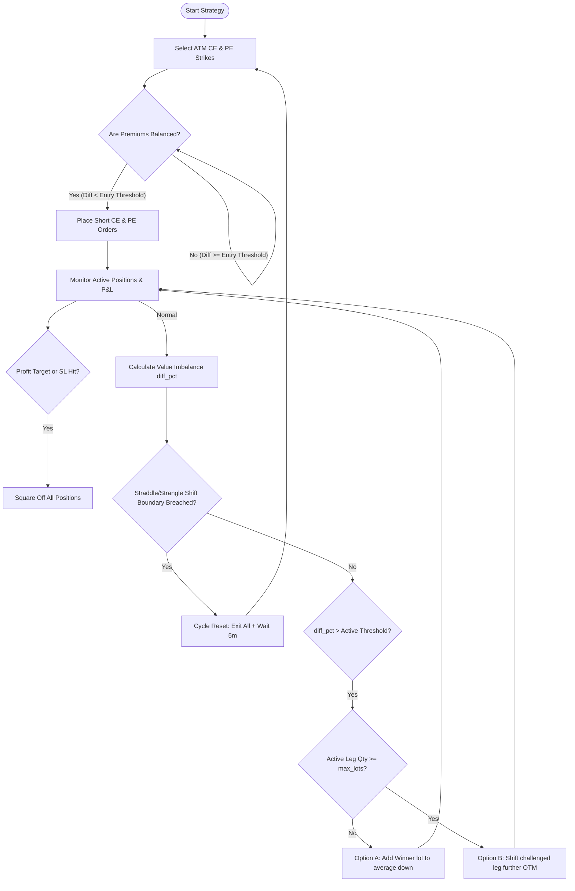

# Nifty Value-Imbalance Strategies

This document covers all option selling strategies in `strategies/value_imbalance/`:
1.  **Nifty Advanced Value-Imbalance Straddle & Strangle** (`nifty_advanced_imbalance.py`)
2.  **Nifty Value-Imbalance Straddle** (`nifty_value_imbalance_straddle.py`)
3.  **Nifty Value-Imbalance Strangle** (`nifty_value_imbalance_strangle.py`)
4.  **Nifty VWAP Straddle** (`nifty_vwap_straddle.py`)

---

## 1. Core Mechanics & Mathematical Formulas

The value-imbalance framework seeks to maintain premium balance (and therefore delta neutrality) in a short option portfolio by dynamically adjusting legs as the underlying market trends.



### A. Mathematical Definitions

*   **Premium Value**:
    $$\text{Value}_{\text{leg}} = \text{Lots}_{\text{leg}} \times \text{LTP}_{\text{leg}}$$
*   **Imbalance Percentage (`diff_pct`)**:
    $$\text{diff\_pct} = \frac{|\text{CE\_val} - \text{PE\_val}|}{\max(\text{CE\_val}, \text{PE\_val})} \times 100$$
*   **Active Trigger Threshold**:
    $$\text{Active Threshold} = \text{Threshold}_{\text{Lot/Strike}} + \text{entry\_diff\_pct}$$
    *(where `entry_diff_pct` is the initial imbalance offset recorded at entry)*

---

## 2. Strategy Phases (Legacy Straddle & Strangle)

The standard straddle (`nifty_value_imbalance_straddle.py`) and strangle (`nifty_value_imbalance_strangle.py`) strategies operate in five distinct phases:

### Phase 1: Initialization & ATM Selection
*   Fetches the current Nifty spot price.
*   Identifies ATM strike (for straddle) or OTM strikes (for strangle).
*   Resolves contract IDs and fetches current lot sizes dynamically.

### Phase 2: Balanced Entry Check
*   Monitors premium prices.
*   Triggers entry only when the premium difference is below the threshold (default: `< 15.0%` for straddle, `< 25.0%` for strangle).

### Phase 3: Value Balancing (Lot Addition)
*   If the market trends and `diff_pct` exceeds the `threshold_lot` (default: `25.0%` + entry offset):
    *   Sells `1` additional lot on the **Winner** (cheaper, decaying) leg.
    *   Averages down the entry price and collects more theta decay to offset the losing leg.
    *   Repeats until `max_lots` (default: `4`) is reached.

### Phase 4: Single-Leg Strike Adjustment
*   If `max_lots` is reached and `diff_pct` exceeds `threshold_strike` (default: `40.0%` + entry offset):
    *   Shifts the **Loser** (expensive, challenged) leg to a further OTM strike.
    *   Selects a new strike such that:
        $$\text{New\_Lots} \times \text{New\_Price} \approx \text{Current\_Value}_{\text{winner}}$$
    *   This resets the risk of the challenged leg without squaring off the entire trade.

### Phase 5: Straddle Shift (Cycle Reset)
*   **Straddle**: If the current ATM strike shifts by **$\ge$ 100 points** from the original entry strike (e.g. when spot reaches `initial_atm + 75` or `initial_atm - 75`, causing the ATM to change by 100 points), the entire trade is squared off, pauses for 5 minutes, and restarts.
*   **Strangle**: If spot breaches the outer strike boundaries, exits all positions, pauses 5 minutes, and restarts a fresh strangle.

---

## 3. Advanced Strategy Mode Variations (`nifty_advanced_imbalance.py`)

The advanced script introduces selectable adjustment logic modes to optimize margin efficiency and hedge tail risk:

### A. `winner_roll_atm` (Default)
*   **Action**: Checks the value of the losing leg and chooses the appropriate strike to balance the winner leg's premium against that value, maintaining a flat 1:1 lot ratio.
*   **Benefit**: Eliminates margin inflation by keeping lot counts static.
*   **Inversion Prevention**: Strictly enforces `CE strike > PE strike`. If a roll would cross strikes, it triggers an emergency cycle exit.

### B. `loser_ratio_roll`
*   **Action**: Rolls the challenged loser leg further OTM and increments quantity (ratio spread) to maintain premium collections.
*   **Benefit**: Highly configurable lot increment size (default: `1` lot increment via `--loser-ratio-lots`).

### C. `hedged_addition`
*   **Action**: Adds short lots to the winner leg (like legacy) but buys further OTM options (200 pts out) to hedge against market whipsaws.
*   **Benefit**: Limits potential reversal losses to:
    $$\text{Max Wing Loss} = \text{Strike Difference (200)} - \text{Net Credit Added}$$

### D. `legacy`
*   **Action**: Original unhedged winner lot addition strategy.

---

## 4. CLI Parameters Reference

### A. Nifty Advanced Value-Imbalance Strategy (`nifty_advanced_imbalance.py`)

| CLI Flag | Default | Description |
| :--- | :--- | :--- |
| **`--live`** | *Flag* | Enable real order placement (defaults to dry-run mode). |
| **`--lots N`** | `1` | Initial lots per leg. |
| **`--mode MODE`** | `winner_roll_atm` | Selects adjustment mode (`winner_roll_atm`, `loser_ratio_roll`, `hedged_addition`, `legacy`). |
| **`--loser-ratio-lots N`** | `1` | Number of lots to increment during a loser ratio roll adjustment. |
| **`--entry-type TYPE`** | `straddle` | Entry position type (`straddle`, `strangle`). |
| **`--delta`** | *Flag* | Use delta-based strike selection for strangle. |
| **`--target-delta D`** | `0.20` | Target absolute delta in delta strangle mode. |
| **`--premium`** | *Flag* | Use premium-based strike selection for strangle. |
| **`--target-premium PREM`** | `50.0` | Target premium in premium strangle mode. |
| **`--ce-offset PTS`** | `200` | Points above spot for CE strike in distance strangle. |
| **`--pe-offset PTS`** | `200` | Points below spot for PE strike in distance strangle. |
| **`--target-profit AMT`** | `4000.0` | Global daily profit target in ₹. |
| **`--stop-loss AMT`** | `4000.0` | Global daily stop loss in ₹. |
| **`--start-time TIME`** | `09:20` | Market start monitoring time (HH:MM IST). |

### B. Nifty Value-Imbalance Straddle Strategy (`nifty_value_imbalance_straddle.py`)

| CLI Flag | Default | Description |
| :--- | :--- | :--- |
| **`--live`** | *Flag* | Enable real order placement (defaults to dry-run mode). |
| **`--lots N`** | `1` | Initial lots per leg. |
| **`--target-profit AMT`** | `4000.0` | Global daily profit target in ₹. |
| **`--stop-loss AMT`** | `4000.0` | Global daily stop loss in ₹. |
| **`--start-time TIME`** | `09:20` | Market start monitoring time (HH:MM IST). |
| **`--entry-balance-threshold PCT`** | `15.0` | Initial balance threshold percentage for entry. |

### C. Nifty Value-Imbalance Strangle Strategy (`nifty_value_imbalance_strangle.py`)

| CLI Flag | Default | Description |
| :--- | :--- | :--- |
| **`--live`** | *Flag* | Enable real order placement (defaults to dry-run mode). |
| **`--lots N`** | `1` | Initial lots per leg. |
| **`--delta`** | *Flag* | Use delta-based strike selection. |
| **`--distance`** | *Flag* | Use fixed-point offset strike selection (default). |
| **`--premium`** | *Flag* | Use premium-based strike selection. |
| **`--ce-offset PTS`** | `200` | Points above spot for CE strike. |
| **`--pe-offset PTS`** | `200` | Points below spot for PE strike. |
| **`--target-delta D`** | `0.20` | Target absolute delta in delta mode. |
| **`--target-premium PREM`** | `50.0` | Target premium in premium mode. |
| **`--target-profit AMT`** | `4000.0` | Global daily profit target in ₹. |
| **`--stop-loss AMT`** | `4000.0` | Global daily stop loss in ₹. |
| **`--start-time TIME`** | `09:20` | Market start monitoring time (HH:MM IST). |

---

## 5. Execution Examples

> [!IMPORTANT]
> All commands must be executed from the project root directory (`c:\dhan_algo\dhan_algo`) using the virtual environment python interpreter (`venv\Scripts\python.exe`).

### Activate Virtual Environment (One-time per terminal session)
```powershell
c:\dhan_algo\dhan_algo\venv\Scripts\activate
```

---

### A. Nifty Advanced Straddle & Strangle (`nifty_advanced_imbalance.py`)

#### 1. Dry Run Simulations (Safe — No Orders Placed)
*   **Straddle with Winner Roll (Default mode, 1 lot initial)**:
    ```powershell
    venv\Scripts\python.exe strategies/value_imbalance/nifty_advanced_imbalance.py --entry-type straddle --mode winner_roll_atm
    ```
*   **Strangle (Distance offset, Hedged Addition, 1 lot, custom offset)**:
    ```powershell
    venv\Scripts\python.exe strategies/value_imbalance/nifty_advanced_imbalance.py --entry-type strangle --ce-offset 150 --pe-offset 250 --mode hedged_addition
    ```
*   **Strangle (Delta-based selection, Winner Roll, target delta 0.15)**:
    ```powershell
    venv\Scripts\python.exe strategies/value_imbalance/nifty_advanced_imbalance.py --entry-type strangle --delta --target-delta 0.15 --mode winner_roll_atm
    ```
*   **Strangle (Premium-based selection, Loser Ratio Roll, target premium <= 35, 1 lot increment)**:
    ```powershell
    venv\Scripts\python.exe strategies/value_imbalance/nifty_advanced_imbalance.py --entry-type strangle --premium --target-premium 35 --mode loser_ratio_roll --loser-ratio-lots 1
    ```

#### 2. Live Trading (Real Orders)
*   **Live Straddle (Winner Roll, 2 lots initial)**:
    ```powershell
    venv\Scripts\python.exe strategies/value_imbalance/nifty_advanced_imbalance.py --live --lots 2 --entry-type straddle --mode winner_roll_atm
    ```
*   **Live Strangle (Premium-based, Loser Ratio Roll, target premium <= 40, 2-lot increments, custom profit/stop limits)**:
    ```powershell
    venv\Scripts\python.exe strategies/value_imbalance/nifty_advanced_imbalance.py --live --lots 2 --entry-type strangle --premium --target-premium 40 --mode loser_ratio_roll --loser-ratio-lots 2 --target-profit 5000 --stop-loss 3000
    ```
*   **Live Strangle (Delta-based 0.20, Hedged Addition, 1 lot initial, start at 09:25 IST)**:
    ```powershell
    venv\Scripts\python.exe strategies/value_imbalance/nifty_advanced_imbalance.py --live --lots 1 --entry-type strangle --delta --target-delta 0.20 --mode hedged_addition --start-time 09:25 --target-profit 4000 --stop-loss 4000
    ```

---

### B. Nifty Value-Imbalance Strangle Strategy (`nifty_value_imbalance_strangle.py`)

#### 1. Dry Run Simulations (Safe — No Orders Placed)
*   **Symmetric Strangle (Distance mode, CE/PE 200 pt offset, 1 lot)**:
    ```powershell
    venv\Scripts\python.exe strategies/value_imbalance/nifty_value_imbalance_strangle.py --ce-offset 200 --pe-offset 200
    ```
*   **Asymmetric Strangle (Distance mode, tighter CE offset 150 pt, wider PE offset 300 pt)**:
    ```powershell
    venv\Scripts\python.exe strategies/value_imbalance/nifty_value_imbalance_strangle.py --ce-offset 150 --pe-offset 300
    ```
*   **Strangle (Delta mode, target delta 0.20)**:
    ```powershell
    venv\Scripts\python.exe strategies/value_imbalance/nifty_value_imbalance_strangle.py --delta --target-delta 0.20
    ```
*   **Strangle (Premium mode, target premium <= 50.0)**:
    ```powershell
    venv\Scripts\python.exe strategies/value_imbalance/nifty_value_imbalance_strangle.py --premium --target-premium 50.0
    ```

#### 2. Live Trading (Real Orders)
*   **Live Symmetric Strangle (Distance mode, 200 pt offset, 1 lot)**:
    ```powershell
    venv\Scripts\python.exe strategies/value_imbalance/nifty_value_imbalance_strangle.py --live
    ```
*   **Live Strangle (Distance mode, wider 300 pt offset, 2 lots, custom profit/loss target)**:
    ```powershell
    venv\Scripts\python.exe strategies/value_imbalance/nifty_value_imbalance_strangle.py --live --lots 2 --ce-offset 300 --pe-offset 300 --target-profit 6000 --stop-loss 3000
    ```
*   **Live Strangle (Delta mode, target delta 0.15, 2 lots)**:
    ```powershell
    venv\Scripts\python.exe strategies/value_imbalance/nifty_value_imbalance_strangle.py --live --lots 2 --delta --target-delta 0.15
    ```
*   **Live Strangle (Premium mode, target premium <= 35.0, 1 lot, start at 09:25 IST)**:
    ```powershell
    venv\Scripts\python.exe strategies/value_imbalance/nifty_value_imbalance_strangle.py --live --premium --target-premium 35 --start-time 09:25
    ```

---

### C. Nifty Value-Imbalance Straddle Strategy (`nifty_value_imbalance_straddle.py`)

#### 1. Dry Run Simulations (Safe — No Orders Placed)
*   **ATM Straddle (Default settings, 1 lot)**:
    ```powershell
    venv\Scripts\python.exe strategies/value_imbalance/nifty_value_imbalance_straddle.py
    ```
*   **ATM Straddle (Custom entry balance threshold of 10%)**:
    ```powershell
    venv\Scripts\python.exe strategies/value_imbalance/nifty_value_imbalance_straddle.py --entry-balance-threshold 10
    ```

#### 2. Live Trading (Real Orders)
*   **Live ATM Straddle (Default settings, 2 lots)**:
    ```powershell
    venv\Scripts\python.exe strategies/value_imbalance/nifty_value_imbalance_straddle.py --live --lots 2
    ```
*   **Live ATM Straddle (Custom risk targets, custom start time 09:25 IST)**:
    ```powershell
    venv\Scripts\python.exe strategies/value_imbalance/nifty_value_imbalance_straddle.py --live --lots 1 --target-profit 5000 --stop-loss 3000 --start-time 09:25
    ```
*   **Live ATM Straddle (Tighter initial entry balance threshold of 5%)**:
    ```powershell
    venv\Scripts\python.exe strategies/value_imbalance/nifty_value_imbalance_straddle.py --live --entry-balance-threshold 5
    ```

---

## 6. Detailed Trade Flow Examples

Here are step-by-step examples of how trades flow under different market conditions.

### Scenario A: Symmetrical Decay & Target Exit (No Adjustments)
1.  **Selection & Balanced Entry**: 
    *   Nifty Spot is `24,015`. Rounding to nearest `50` yields `24,000` ATM strike.
    *   `24000 CE` trades @ ₹120; `24000 PE` trades @ ₹115.
    *   Difference = $(120 - 115) / 120 \times 100 = 4.17\%$. Since $4.17\% < 15.0\%$ entry threshold, the trade is entered (Sell 1 lot CE @ ₹120, Sell 1 lot PE @ ₹115).
    *   Initial `entry_diff_pct` offset is recorded as `4.17%`.
2.  **Symmetrical Market Decay**:
    *   Market ranges between `23,980` and `24,020` for two hours.
    *   `24000 CE` decays to ₹80; `24000 PE` decays to ₹75.
    *   Combined unrealized profit: $(120 - 80 + 115 - 75) \times 75 \text{ (lot size)} = \mathbf{₹6,000}$ (assuming Nifty lot size is 75).
3.  **Target Reached & Square Off**:
    *   Total P&L (₹6,000) exceeds target profit limit of ₹4,000.
    *   The strategy executes market buy back orders to close both legs and terminates for the day.

---

### Scenario B: Dynamic Lot Addition (Martingale Balancing)
1.  **Entry Setup**: 
    *   Short 1 lot `24000 CE` @ ₹120; Short 1 lot `24000 PE` @ ₹115. Offset: `4.17%`.
    *   Lot addition trigger threshold: $25\% + 4.17\% = \mathbf{29.17\%}$.
2.  **Market Trending Move**:
    *   Spot climbs to `24,070`.
    *   `24000 CE` spikes to ₹170 (Value: ₹170).
    *   `24000 PE` decays to ₹70 (Value: ₹70).
    *   Imbalance = $(170 - 70) / 170 \times 100 = 58.82\%$. This breaches the $29.17\%$ trigger.
3.  **Adjustment (Lot Addition)**:
    *   Leg count ($1$) is less than `max_lots` ($4$).
    *   Sells `1` additional lot on the winning (cheaper) side: `24000 PE` @ ₹70.
    *   PE Avg Price is updated to: $(115 + 70) / 2 = \mathbf{₹92.50}$ (2 lots).
    *   Baseline offset `entry_diff_pct` is recalculated:
        $$\text{CE Value} = 1 \times 170 = 170$$
        $$\text{PE Value} = 2 \times 70 = 140$$
        $$\text{new\_entry\_diff\_pct} = \frac{170 - 140}{170} \times 100 = 17.65\%$$
    *   Active trigger threshold becomes: $25\% + 17.65\% = \mathbf{42.65\%}$.
4.  **Subsequent Monitoring**:
    *   Market stabilizes. The 2 lots of `24000 PE` decay twice as fast, neutralizing the risk of the challenged CE.

---

### Scenario C: OTM Winner Rolling (`winner_roll_atm` Mode)
1.  **Entry Setup**: 
    *   Short 1 lot `24000 CE` @ ₹120; Short 1 lot `24000 PE` @ ₹115. Offset: `4.17%`.
    *   Trigger threshold: $25\% + 4.17\% = \mathbf{29.17\%}$.
2.  **Market Trending Move**:
    *   Spot climbs to `24,070`.
    *   `24000 CE` spikes to ₹170; `24000 PE` decays to ₹70. Imbalance = $58.82\% > 29.17\%$.
3.  **Adjustment (Winner Value-Balanced Roll)**:
    *   Instead of adding lots or rolling blindly to ATM, the strategy checks the value of the losing PE leg (1 lot * ₹170 = ₹170) and selects the PE strike whose value matches ₹170.
    *   Action: Buys to close `24000 PE` @ ₹70 (Realized Profit: +₹45).
    *   Action: Queries option chain for the PE strike trading closest to ₹170 (e.g., `24050 PE` @ ₹105).
    *   Action: Sells 1 lot `24050 PE` @ ₹105.
    *   New Position: `24000 CE` (1 lot @ avg ₹120) & `24050 PE` (1 lot @ avg ₹105).
    *   Premium balance is restored with zero margin inflation.

---

### Scenario D: Straddle Shift (Cycle Reset)
1.  **Entry Setup**: 
    *   Initial Nifty Spot is `24,015`. Sells `24000 CE` & `24000 PE` ATM Straddle.
    *   Initial ATM strike `initial_ce_strike` is recorded as `24,000`.
2.  **Market Trending Move**:
    *   Heavy buying pushes Nifty Spot to `24,076`.
    *   The current spot ATM strike becomes `24,100` (since `int(round(24076 / 50) * 50) = 24100`).
3.  **Cycle Reset Trigger**:
    *   The strategy calculates `current_atm` as `24,100`.
    *   The strike shift distance is:
        $$\text{Shift Distance} = |24100 - 24000| = \mathbf{100\text{ points}}$$
    *   Since the ATM strike has shifted by $\ge 100$ points (meaning the strike that was originally 100 points above the initial ATM has now become the current ATM), the shift triggers.
    *   **Action**: Immediately buys to close all active straddle positions (`24000 CE` and `24000 PE`) to protect against extreme directional moves.
    *   Pauses for **5 minutes** (cooldown) and then restarts a fresh cycle at the new ATM strike (`24,100`).

---

## 7. Nifty 1-Min VWAP Straddle (`nifty_intraday_vwap_straddle.py`)

A mean-reversion short straddle that uses the **true Volume-Weighted Average Price of the combined straddle premium** (CE + PE), computed from 1-minute OHLCV candles fetched via the Dhan API. There are no lot additions or strike adjustments — each cycle is a simple sell → monitor → exit → repeat loop.

### A. Concept & VWAP Calculation

At the start of every new completed 1-minute bar, the strategy re-fetches intraday candles for both CE and PE legs, merges them on timestamp, builds a combined straddle OHLCV series, and recomputes the session VWAP from the session open (09:15 IST):

$$\text{VWAP} = \frac{\sum(\text{TP}_i \times V_i)}{\sum V_i}$$

where:
- $\text{TP}_i = \frac{(\text{CE\_High}_i + \text{PE\_High}_i) + (\text{CE\_Low}_i + \text{PE\_Low}_i) + (\text{CE\_Close}_i + \text{PE\_Close}_i)}{3}$ — combined straddle typical price per bar
- $V_i = \frac{\text{CE\_Volume}_i + \text{PE\_Volume}_i}{2}$ — average leg volume per bar; zero-volume bars use $V_i = 1$ (TWAP fallback for quiet bars)

A configurable warm-up (`--vwap-warmup-bars`, default 10 bars ≈ 10 min) must elapse before the VWAP is trusted for trade decisions.

The VWAP resets whenever an ATM shift is detected (spot moves to a new 50-point bracket), because the underlying contracts change and the prior price history is no longer relevant.

> **Implementation note**: Candles are fetched with a 2-day window (yesterday → today) to avoid a DH-905 API error that occurs on same-day-only requests.

### B. State Machine

```mermaid
stateDiagram-v2
    [*] --> WarmUp: Session starts, subscribe to ATM CE & PE\nBootstrap VWAP from existing candles
    WarmUp --> Monitoring: vwap_bars >= vwap_warmup_bars
    Monitoring --> InPosition: combined ≤ VWAP + entry_band\nAND declining over decline_ticks WS ticks\nAND |CE−PE| / max < max_premium_diff_pct
    InPosition --> Monitoring: combined > VWAP + exit_buffer\n(buy back both legs)
    InPosition --> InPosition: ATM shifted while in position\n(record pending_atm; hold until exit)
    Monitoring --> WarmUp: ATM shifted while out of position\n(re-subscribe new CE/PE, reset VWAP)
    InPosition --> [*]: Profit target, stop loss, or 15:17 auto-exit
    Monitoring --> [*]: Profit target, stop loss, or 15:17 auto-exit
```



| Phase | Condition | Action |
|---|---|---|
| **Warm-up** | `vwap_bars < vwap_warmup_bars` | Refresh candles each minute; no trading |
| **Entry** | All three gates pass (see §C) | Sell ATM CE + PE |
| **Hold** | `combined ≤ VWAP + exit_buffer` | Stay in position; VWAP refreshes each minute |
| **Exit** | `combined > VWAP + exit_buffer` | Buy back both legs, book PnL; re-enter on next signal |
| **ATM shift (out)** | Spot moves to new 50-pt bracket, no position | Re-subscribe new ATM CE/PE, reset VWAP, warm up again |
| **ATM shift (in)** | Spot moves to new 50-pt bracket, in position | Record pending ATM; re-center only after position is closed |

### C. Entry Conditions

All three gates must pass simultaneously before a position is opened:

1. **VWAP ready** — `vwap_bars >= vwap_warmup_bars`
   Ensures the VWAP has enough history to be a meaningful reference.

2. **Price gate** — `combined_ltp ≤ candle_vwap + entry_band`
   Ensures the straddle is sold at or near its volume-weighted average cost, not during a premium spike.

3. **Decline gate** — `combined_ltp < recent_combined[0]` over the last `decline_ticks` WebSocket ticks
   Requires the combined premium to be falling in the immediate short window, avoiding entries during an upswing.

4. **Balance gate** — `|CE_LTP − PE_LTP| / max(CE_LTP, PE_LTP) × 100 < max_premium_diff_pct`
   Guards against directionally skewed entries where one leg has already moved significantly.

### D. CLI Parameter Reference

| Flag | Default | Description |
|---|---|---|
| `--live` | off (dry run) | Enable real order placement |
| `--lots N` | `1` | Lots per leg (CE and PE symmetric) |
| `--start-time HH:MM` | `09:20` | Session start monitoring time (IST) |
| `--entry-band PTS` | `5` | Max points **above** VWAP at which entry is permitted (`combined ≤ VWAP + entry_band`). |
| `--decline-ticks N` | `5` | WebSocket-tick window: combined premium must be falling vs the oldest value in this window. |
| `--exit-buffer PTS` | `10` | Points **above** VWAP that trigger exit (`combined > VWAP + exit_buffer`). Keep `exit_buffer ≥ entry_band`. |
| `--max-premium-diff PCT` | `15` | Max allowed % difference between CE and PE premiums at entry. |
| `--vwap-warmup-bars N` | `10` | Min completed 1-min bars (≈ 10 min) before VWAP is trusted for trading. |
| `--target-profit INR` | `4000` | Session profit target — strategy pauses until next day once reached. |
| `--stop-loss INR` | `4000` | Session stop loss (positive value) — strategy pauses until next day once total PnL < −stop_loss. |

### E. Parameter Tuning Guide

**`--entry-band`**
Controls how eagerly the strategy enters. `0` = only enter at or below VWAP. `5` (default) allows entry up to 5 pts above VWAP, capturing the typical oscillation band. Raise to `8–10` on high-IV days when premiums are choppier.

**`--decline-ticks`**
Higher values (e.g., `8–10`) require a longer sustained decline before entry — fewer but higher-conviction trades. Lower values (e.g., `3`) respond faster but may enter during brief dips within an upswing.

**`--exit-buffer`**
Controls spike tolerance before exiting. Default `10` pts provides room for small intraday moves. Reduce to `5–7` for tighter risk control. Always keep `exit_buffer ≥ entry_band`.

**`--max-premium-diff`**
Lower values (e.g., `10`) demand more delta-neutral entries — fewer trades, higher quality. Default `15` is balanced. On volatile days raise to `20` for more entry opportunities.

**`--vwap-warmup-bars`**
Default `10` bars (≈ 10 min). Raise to `15–20` on open-of-day when premiums are noisy. The VWAP bootstraps from existing candles at strategy start, so warmup may complete quickly if the session is already underway.

### F. Execution Examples

```powershell
# Dry run — 1 lot, all defaults
venv\Scripts\python.exe strategies/value_imbalance/nifty_intraday_vwap_straddle.py

# Live, 2 lots, defaults
venv\Scripts\python.exe strategies/value_imbalance/nifty_intraday_vwap_straddle.py --live --lots 2

# Tighter exit: exit when combined rises 8 pts above VWAP
venv\Scripts\python.exe strategies/value_imbalance/nifty_intraday_vwap_straddle.py --live --exit-buffer 8

# Stricter balance: only enter when CE/PE differ by < 10%
venv\Scripts\python.exe strategies/value_imbalance/nifty_intraday_vwap_straddle.py --live --max-premium-diff 10

# Wider entry band, longer decline confirmation
venv\Scripts\python.exe strategies/value_imbalance/nifty_intraday_vwap_straddle.py --live --entry-band 8 --decline-ticks 8

# Longer VWAP warm-up (15 bars ≈ 15 min), for post-open volatility
venv\Scripts\python.exe strategies/value_imbalance/nifty_intraday_vwap_straddle.py --live --vwap-warmup-bars 15

# Custom risk targets, later start time
venv\Scripts\python.exe strategies/value_imbalance/nifty_intraday_vwap_straddle.py --live --lots 2 --target-profit 6000 --stop-loss 3000 --start-time 09:25
```
